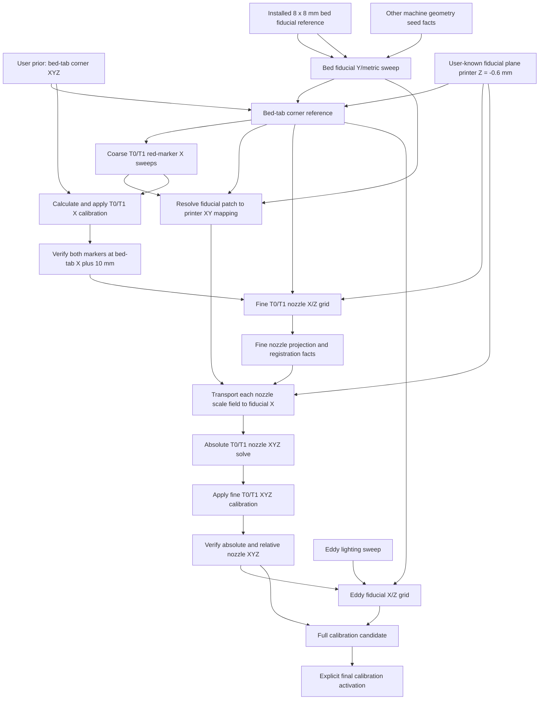

# Vision Calibration Jobs, Facts, and Dependency Graph

## Purpose

This document describes the calibration layer that should sit on top of the
existing Klipper vision-job runtime.

Every vision calibration job has the same three logical phases:

1. generate and run deterministic G-code that acquires a declared set of images
2. analyze only those committed images
3. publish the facts supported by the analysis

The important addition is that facts are versioned inputs to later jobs.
Downstream results bind to exact upstream fact IDs, not merely to names such as
“the current bed calibration.” When an authoritative job publishes replacement
facts, results derived from the replaced facts become stale.

This makes calibration a reproducible dependency graph instead of a sequence of
scripts that happen to share values in `calib.yaml`.

The clean acquisition runtime, synchronized capture, and job directory layout
are described in `VISION_JOB_CONCEPT.md`. This document defines the
calibration-specific graph above that runtime.

### X/Z workflow status

The active X/Z calibration job is `idex_tool_xz_sweep_report`, which acquires
both tools and uses the ArUco-located ROI with the bright-circle nozzle finder.
The former independent per-tool fine-XZ workflow and its fine-tool XYZ
calculation/application stages are retired and must not be reintroduced. Any
older job IDs or payload examples later in this historical design document are
preserved only as documentation of the previous graph; they are not live job
types or supported commands.

### Terminology note

The first observed bed-reference stage uses the four-marker patch now attached
to the underside of the print bed. The printed pattern contains four identical
3 mm concentric-circle fiducials whose centers form an 8 x 8 mm square. The
printed scale was physically checked before installation.

That stage still commands printer **Y** back and forth. The known square gives
an absolute in-plane metric while the commanded motion identifies printer +Y
and measures the image-space Y/parallax vector. The identical square does not
by itself identify printer +X versus -X; the later red-marker X sweep resolves
that remaining sign.

## Design Principles

- Raw images, manifests, sidecars, analysis results, and facts are immutable.
- Re-analysis creates a new analysis run; it never rewrites old facts.
- Relative image registration is preferred. A detector may locate a tight ROI,
  but calibration should come from aligning homologous image content.
- A missing red marker or hidden nozzle rejects that observation, not
  necessarily the whole acquisition.
- Facts carry units, coordinate frames, concrete quality measurements, and
  provenance.
- Do not invent or propagate uncertainty estimates or covariance matrices.
  Store directly observed evidence such as residuals, repeatability,
  correlation, accepted/rejected observations, and sweep coverage.
- Job definitions declare the fact types they require and produce.
- A concrete job manifest binds every requirement to an exact fact ID.
- Only accepted authoritative facts advance the current calibration graph.
- Rejected and diagnostic jobs remain visible but do not invalidate anything.
- Applying calibration is a separate state-changing operation with its own
  provenance. An image analyzer never silently edits live configuration.
- Stale facts remain inspectable. Staleness prevents reuse; it does not erase
  history or automatically roll back an active printer configuration.

## Runtime Model

The word “job” is useful in the UI, but the persisted model should distinguish
acquisition from analysis:

```text
Vision calibration run
  |
  +-- Acquisition run
  |     manifest.json
  |     acquisition.gcode
  |     frames/*.jpg
  |     frames/*.json
  |
  +-- Analysis run 1
  |     result.json
  |     facts.json
  |     overlays/
  |
  +-- Analysis run 2
        result.json
        facts.json
        overlays/
```

An acquisition run is tied to printer motion and camera state. It cannot be
repeated without creating a new acquisition ID.

An analysis run is pure: it consumes one acquisition plus exact upstream facts.
Improved analysis code may analyze the same images again, but it produces a new
analysis ID and new fact set.

The existing job states continue to describe acquisition and the first
analysis:

```text
prepared -> acquiring -> acquired -> analysing -> completed
```

The calibration catalog adds graph-level status:

- `current`: accepted and selected as the current fact set for its scope
- `stale`: accepted, but at least one exact input fact is no longer current
- `superseded`: replaced by a newer accepted fact set with the same semantic
  output and applicability scope
- `rejected`: analysis completed but did not publish usable facts
- `diagnostic`: deliberately non-authoritative and never selected as current

## Calibration Dependency Graph

The intended end-to-end graph is:



The runtime has two kinds of roots:

- observed roots, produced by vision jobs
- flat static values from `priors.yaml`, accessed through `CalibDAO`

Prior changes apply to new preparations and analyses. Existing published facts
remain usable until the operator deliberately reruns the affected chain.
Historical seed facts remain accepted only so existing catalogs rebuild.

## Calibration Stages

### 0. User-defined bed-tab coordinate prior

Before any absolute calibration job can run, the user defines the printer
coordinates of the physical bed-tab corner:

```yaml
bed_tab_corner_prior:
  x_mm: 173.0
  y_mm: -18.0
  z_mm: 0.0
```

This is the current user-defined coordinate identity of the physical corner,
not an image-derived estimate. `CalibDAO.bed_corner()` reads it from the flat
`bed_corner_xyz_mm` entry in `priors.yaml`.

Vision does not discover or silently refine these absolute printer
coordinates. The corner-reference job finds the corresponding pixel and binds
that observation to the current configured value.

The installed pattern is described by the flat fiducial origin and spacing
entries. `CalibDAO.fiducial_centers()` calculates:

- marker centers at patch-local `[3,3]`, `[11,3]`, `[3,11]`, and `[11,11] mm`
- center spacing `8 mm` in both patch axes

The target remains four white concentric-circle markers on black, rigidly
attached to the underside of the print bed.

The patch's pixel position, rotation, and relation to printer axes are
deliberately not configuration. They are observed on every applicable run.

### 1. Bed-fiducial Y/metric scale

Job type:

```text
nozzle_cam_bed_fiducial_y_metric
```

Acquisition:

- use the standard fixed nozzle-camera profile and lighting
- move commanded Y back and forth by known distances
- capture all four bed-attached fiducials at each position
- include reversals so backlash or direction-dependent registration can be
  measured
- use the six-frame forward/reverse sequence `[0, 10, 20, 20, 10, 0] mm`
- keep the same camera profile, exposure, gain, white balance, and light values
  for all six frames

Analysis:

- find groups of four concentric-circle candidates consistent with a projective
  image of an 8 x 8 mm square; do not hardcode their image location
- use circle/ring detection only to initialize four tight ROIs
- align each fiducial ROI through forward and reverse frame chains using
  grayscale, CLAHE, and gradient registration
- jointly fit the four marker centers, one local patch-plane homography, and
  image displacement against commanded Y
- use commanded +Y motion to resolve the signed printer-Y image vector
- use the known square metric to recover local physical scale in both in-plane
  directions without assuming that the glued patch is aligned to printer X/Y
- retain the two possible printer-X signs; Stage 3 resolves the sign from
  commanded X motion
- compare the 8 mm printed dimensions with commanded-Y displacement as an
  independent consistency check
- reject low-correlation matches, clipped rings, glare-biased centers,
  direction-dependent outliers, and stationary enclosure features

Produced fact:

- `camera.nozzle_cam.bed_fiducial.local_metric_model`, with role
  `coordinate_system`, containing:
  - the signed two-dimensional image displacement per printer +Y millimetre
  - the local patch-mm-to-image-pixel homography at the reference capture
  - the unresolved pair of possible printer-X image directions
  - an exact binding to the installed physical reference
  - enough patch-coordinate information to reconstruct the signed
    patch-to-printer basis after Stage 3 resolves printer +X
  - the image-space printer-X vector at the physical center of the four
    fiducials, not only a scalar average marker spacing

The analysis must retain the local metric at every acquired commanded-Y
position, not only at one reference frame. It fits the first-order change of
the printer-X vector with commanded Y. A downstream job captured at a slightly
different Y can therefore evaluate the fiducial reference at its exact capture
Y instead of assuming that camera depth is unchanged.

Scalar scales, inverse scales, angles, correlations, residuals, and individual
marker centers are shown in reports. Only the coordinate-defining model fields
are displayed in the current-facts overview.

This fact establishes an absolute local bed-attached fiducial-plane metric and
signed image-space Y direction. It does not establish an absolute image
origin, the sign of printer X, or the print-plane Z relationship.

### 2. Bed-tab corner reference

Job type:

```text
nozzle_cam_bed_tab_corner
```

Dependencies:

- current accepted bed-fiducial local metric fact
- current user-defined `bed.tab_corner.printer_xyz` prior
- current `bed.fiducial_patch.printer_z_mm` seed

Acquisition:

- capture several duplicates of the bed-tab corner at a fixed safe pose
- keep the four installed fiducials and the tab corner in the same frame
- use a separate bright, glare-friendly corner profile; the low-glare
  fiducial profile is deliberately not reused because it hides the tab side
  edge
- the initial fixed corner setup is the `vision` camera profile with all eight
  light pixels at `0.45`; this setting intentionally permits clipping and
  specular glare where they strengthen the tab-edge geometry
- record the exact corner camera profile and light values in the manifest and
  applicability scope

Analysis:

- find the two tab edges and their intersection
- use edge or line detection only for initial localization
- predict the four-marker location from the accepted local metric model at the
  exact corner-capture Y position; the bright corner image is not required to
  re-detect all four low-glare fiducial rings
- refine the corner by registering all bright duplicates to whichever frame
  gives the strongest semantic tab-edge intersection
- measure the corner relative to that observed patch rather than to a
  hardcoded corner ROI
- bind the observed corner pixel to the exact commanded Y coordinate of the
  corner capture
- project the corner through the accepted bed-plane metric from that capture
  pose

Produced facts:

- `camera.nozzle_cam.partial_bed_coordinate_system`, which binds:
  - the observed corner pixel
  - the exact commanded Y at which that pixel was observed
  - the accepted bed-fiducial local metric model
  - the observed patch-to-corner transform
  - the exact user-prior fact ID
  - the exact fiducial-plane printer-Z fact ID

The observed pixel and the physical prior are deliberately different pieces of
information. The prior Y identifies the physical corner in printer
coordinates; the observed capture Y identifies the bed pose at which the
corner pixel was measured. A downstream image captured at another Y projects
the corner with:

```text
corner_pixel_at_capture =
    observed_corner_pixel
    + bed_metric.image_y_axis_vector_px_per_mm
      * (capture_y_mm - observed_corner_capture_y_mm)
```

Using the prior Y in place of `observed_corner_capture_y_mm` is invalid and
shifts every downstream overlay by the difference between those Y values.

At this point one pixel has an absolute bed X/Y identity, and the image Y basis
is known because the pixel observation is bound to the user’s prior. The local
X scale is already known from the printed square, but the sign of printer X is
still unresolved.

The corner fact must retain `corner_patch_xy_mm` as a coordinate-system field.
Together with the corner's printer `[X,Y]`, the metric model's
`patch_y_vector_per_printer_y_mm`, and the Stage 3 printer-X sign, this is the
anchor needed to calculate the printer coordinates of the fiducial centers.

### 3. Coarse red-marker X sweeps

Job type:

```text
idex_tool_red_marker_x_sweep
```

Dependencies:

- current bed-tab corner facts
- current bed-fiducial local metric facts
- current active calibration snapshot

Acquisition:

- run T0 and T1 independently
- command X positions `160, 170, 180, 190, 200, 210 mm`
- use fixed `Y` and commanded `Z=2 mm`
- raise to a safe travel Z before tool changes
- capture one image per commanded position and tool

The red marker is expected to be absent from some images. Absence is an
ordinary rejected observation.

Analysis:

- locate red pixels only to create a tool-local search ROI
- retain detections with acceptable color, shape, and non-clipped bounds
- fit the red-marker image trajectory against commanded X for each tool
- compare T0 and T1 trajectory direction and scale
- choose the printer +X sign from the two candidates in the accepted
  bed-fiducial local metric model
- compare the marker-derived X scale at commanded Z=2 with the
  fiducial-plane metric as a parallax observation
- project the trajectories relative to the bed-tab corner

Produced facts:

- `camera.nozzle_cam.image_x_axis_vector_px_per_mm_at_z2`
- `tool.t0.red_marker_to_bed_tab_x_mm`
- `tool.t1.red_marker_to_bed_tab_x_mm`
- `camera.nozzle_cam.bed_fiducial.printer_xy_mapping`
- marker visibility intervals and fit quality as diagnostics

The resolved bed-fiducial mapping contains:

```text
corner_patch_xy_mm
corner_printer_xy_mm
patch_x_vector_per_printer_x_mm
patch_y_vector_per_printer_y_mm
fiducial_center_printer_xy_mm[4]
fiducial_reference_printer_xy_mm
```

The four printer coordinates and their reference center are derived from the
observed patch geometry; they are not configured pixel locations. With the
current observations, the fiducial reference center is near printer
`X=165.65 mm`. That value is diagnostic evidence from the current installation,
not a hardcoded job parameter.

The image-axis angle is a derived report value rather than a separate fact.
Stage 4 calibrates each tool independently to the fixed bed-tab corner.

The red marker is suitable for coarse localization because it is easy to find
over a large range. It is not the final nozzle reference.

### 4. Rough X calibration activation and verification

Operation type:

```text
apply_rough_tool_x_calibration
```

Dependencies:

- current `tool.t0.red_marker_to_bed_tab_x_mm`
- current `tool.t1.red_marker_to_bed_tab_x_mm`
- exact current `bed.tab_corner.printer_xyz`
- exact active configuration fingerprint used by the coarse acquisition

Behavior:

- treat neither tool as the absolute X reference
- calibrate T0 and T1 independently to the fixed bed-tab corner at `X=173 mm`
- calculate both corrections from existing facts; this operation requires no
  new acquisition images
- create one atomic candidate changing only `tools.t0.x_endstop` and
  `tools.t1.x_endstop`
- do not change either tool's Y or Z calibration
- record both old values, corrections, new values, source fact IDs, source
  config hash, and generated config fingerprint
- apply only after explicit approval
- restart Klipper and require a ready state

For each tool `t`, let:

- `B_x = 173 mm`, from `bed.tab_corner.printer_xyz`
- `X_ref,t` be the `reference_commanded_x_mm` stored in the tool's Stage 3 fact
- `d_t` be its signed `red_marker_to_bed_tab_x_mm.offset_mm`, positive toward
  printer +X

The Stage 3 observation places the marker at printer coordinate
`B_x + d_t` while the tool was commanded to `X_ref,t`. Therefore:

```text
rough_x_residual_t = B_x + d_t - X_ref,t
new_x_endstop_t    = old_x_endstop_t + rough_x_residual_t
```

Changing an endstop by `rough_x_residual_t` moves that tool's physical marker
by the opposite amount at the same commanded coordinate. After activation,
the marker is therefore at physical X=`X_ref,t` when commanded to `X_ref,t`;
with the measured linear X mapping, commanding the tool to X=`B_x` places the
marker at the bed-tab corner. This calculation is performed separately for T0
and T1. Their mutual alignment is a consequence, not the calibration
reference.

Produced activation fact:

- `calibration.rough_tool_x.active_snapshot`

Verification job:

```text
verify_rough_tool_x_at_bed_tab_plus_10
```

The marker is only partially visible at X=`173 mm`, so verification uses a
defined `+10 mm` offset from the calibration anchor. At the same safe viewing
Y/Z pose used by Stage 3, it commands T0 to `X=183`, captures the marker and
bed-tab corner, then safely changes tools, commands T1 to `X=183`, and captures
the same references.

Let `p_corner` be the observed bed-tab corner pixel and `v_x` be
`camera.nozzle_cam.image_x_axis_vector_px_per_mm_at_z2`. The expected marker
position is:

```text
p_expected = p_corner + 10 mm * v_x
```

Verification checks both absolute and relative conditions:

- each marker is `10 mm` toward printer +X from the bed-tab corner when
  projected onto the measured image-X axis
- the T0 and T1 markers have the same image-X coordinate
- each marker is sufficiently visible for a reliable fit

The cross-tool agreement alone is insufficient because both markers could
share the same absolute offset from `p_expected`.

The prior's `Y=-18` and `Z=0` define the corner's printer coordinates; they are
not the acquisition pose. Verification retains the safe camera pose and never
commands Z=0.

The verification produces `calibration.rough_tool_x.verified`, including the
separate T0 and T1 residuals relative to the expected `+10 mm` position and a
marker-coincidence residual. This remains a coarse red-marker gate, not the
final nozzle X calibration.

The fine X/Z job requires both the active rough-X snapshot and its accepted
verification fact. This prevents a fine sweep from being generated against
coordinates that were measured but never activated.

### 5. Fine per-tool nozzle X/Z grids

Job types:

```text
idex_nozzle_fine_xz_grid_t0
idex_nozzle_fine_xz_grid_t1
```

Dependencies:

- bed-fiducial local metric fact
- bed-tab corner and bed reference-plane facts
- red-marker X-axis and per-tool marker-offset facts
- active and verified rough-X calibration snapshot
- fixed nozzle lighting/camera profile

The path is calculated from the current corner prior rather than hardcoded in
printer coordinates. With the current `bed_tab_x=173 mm`, the default X row is:

```text
bed_tab_x + [10, 12.5, 15, 17.5, 20, 22.5, 25] mm
          = [183, 185.5, 188, 190.5, 193, 195.5, 198] mm
```

The initial `1` through `5 mm` Z span and the later three-full-row sparse
survey both proved too weak for a reliable row-removal sensitivity check.
Each tool now uses four complete rows across the same 8 mm span:

```text
Z = [1, 3.6666666667, 6.3333333333, 9] mm
```

This gives an 8 mm measured span and still keeps the conservative minimum at
Z=`1 mm`. Each per-tool job contains 28 frames, and X direction snakes between
rows. Splitting acquisition prevents one tool's localization failure from
hiding inside a combined accepted analysis.
- raise to Z=`9 mm` before every tool change
- never command below Z=`1 mm`

The full rectangular grid remains configurable for later high-precision work.
The same nominal printer-coordinate path is acquired for T0 and T1.

#### Coordinate-free nozzle localization

The nozzle ROI is not a configured pixel rectangle and no marker-to-nozzle
pixel offset is hardcoded.

1. Use the current red-marker trajectory model to identify the tool-local red
   marker. Do not select the largest red component: T1 has other red wiring that
   can be larger than the marker.
2. Search a broad image-size-relative region around the marker for the dark
   outer ring and use it only as a coarse tool-local locator.
3. Inside the located assembly, identify the actual nozzle tip/central orifice.
   The ring is physically about 3 mm above the nozzle tip and therefore cannot
   be the calibrated feature or the scale reference.
4. Circle, ellipse, or ring detection may propose the assembly center only. A
   separate tip detector must identify the central tip feature in every
   reference image.
5. Derive a very small square ROI centered on the observed nozzle tip. Its side
   should normally be only 20–30% of the observed outer-ring diameter and must
   exclude the outer-ring edge, red marker, heater structure, and bed edge.
   This relative size is resolved from each observed tool image; no pixel
   center or fixed pixel rectangle is configured.
6. Track every tip candidate across the X/Z grid.
7. Select the candidate whose motion follows commanded X/Z, whose appearance
   changes smoothly with Z, and whose T0/T1 tip images register consistently.
8. Use only the small tip ROI for authoritative registration, scale, and
   projection measurements. The outer ring remains visible in diagnostic
   overlays solely to show how the tip ROI was localized.

A frame in which the nozzle is hidden, clipped, or ambiguously matched is
excluded. It cannot contribute a calibration fact.

Tip registration must reject a match when the optimized ROI drifts onto the
outer ring. A valid overlay shows the small ROI and its center attached to the
nozzle tip in every frame, plus a separately colored coarse ring locator. This
makes the physical feature identity visually auditable.

#### Registration graph

The authoritative measurements are forward/reverse relative registrations:

- neighboring X images of the same tool at the same Z
- neighboring Z images of the same tool at the center X
- T0/T1 images at corresponding commanded X/Z poses
- duplicate or loop-closing edges where the sparse grid provides them

Use grayscale, CLAHE, and gradient representations. Each edge records
translation, isotropic scale, correlation, forward/reverse disagreement,
boundary status, and rejection reason. The graph is solved jointly after weak
or inconsistent edges are removed.

For each tool, retain the three-observable nozzle state

```text
o = [image_x, image_y, log(apparent_scale)]
```

The authoritative geometry comes from the registered tip position. Apparent
template scale remains an independent consistency observation. A bilinear
position model is insufficient because the live data shows that local
image-X scale changes with both nozzle Z and lateral printer X. Fit the
first-order lateral scale field by making position quadratic in X and linear
in Z:

```text
dx = x - x_ref
dz = z - z_ref

p_t(x,z)
  = p0_t
    + Ax_t   * dx
    + Az_t   * dz
    + Axz_t  * dx*dz
    + Axx_t  * dx^2
    + Axxz_t * dx^2*dz

Jx_t(x,z) = dp_t/dx
  = Ax_t + Axz_t*dz + 2*Axx_t*dx + 2*Axxz_t*dx*dz
```

All coefficients are two-dimensional image vectors. Consequently,
`Jx_t(x,z)` is the local image displacement vector per commanded printer-X
millimetre at any X/Z location covered by, or deliberately extrapolated from,
the survey.

Fit positions directly rather than fitting noisy adjacent finite-difference
scales. The full X rows at commanded Z=`1`, `5`, and `9 mm` identify the
lateral scale field. The center-only Z=`3` and `7 mm` observations constrain
the tip's Z trajectory and template identity but cannot independently identify
scale versus X. Each full row requires at least five usable X observations.

The `dx^2*dz` term is the first-order change with Z of the lateral perspective
gradient. A rational pinhole model may replace this polynomial later, but it
must expose the same local derivative `Jx_t(x,z)` and reproduce the polynomial
fit over the measured range before becoming authoritative.

The bed-fiducial local metric supplies the signed image direction for printer
Y and, after Stage 3 resolves printer +X, the fiducial-plane printer-X
reference vector. This stage publishes the tool-local scale field and
registration evidence. It does not itself edit an endstop.

#### Fiducial-plane Z anchoring by lateral scale transport

The failed calculation compared a nozzle X scale evaluated around
printer X=`189 mm` directly with a fiducial scale observed around
printer X=`165.65 mm`. That confounds two real projective effects:

- scale squeeze with camera depth/Z
- lateral scale variation with image/printer X

The comparison becomes valid only after evaluating both scales at the same
printer-X location.

Let `X_fid` be the printer X coordinate of the physical center of the four
fiducials. Derive it from the current patch installation:

```text
B_patch_from_printer =
    [patch_x_vector_per_printer_x_mm,
     patch_y_vector_per_printer_y_mm]

printer_xy(marker_i) =
    corner_printer_xy
    + inverse(B_patch_from_printer)
      * (marker_patch_xy_i - corner_patch_xy)

X_fid = mean(printer_x(marker_i))
```

No fiducial image coordinate or current numerical `X_fid` is configured.
Replacing or moving the patch necessarily changes the facts used to derive it.

Let `Vx_fid` be the signed image vector per printer-X millimetre measured from
the 8 mm square at its physical center and evaluated at the exact Stage 5
capture Y. Define:

```text
ex_fid = Vx_fid / |Vx_fid|
Sx_fid = |Vx_fid|

Sx_t_at_fid(z) = dot(Jx_t(X_fid, z), ex_fid)
```

For each tool independently, solve:

```text
Sx_t_at_fid(z_cmd_at_fiducial_plane) = Sx_fid
```

This is the original scale-squeeze idea with the missing lateral-perspective
transport restored. The vector magnitude crossing is calculated as an
independent check and should give the same answer. A solver must not compare
`Jx_t(x_ref,z)` directly with `Vx_fid`.

The printed patch is attached below the print surface:

```text
Z_fiducial_plane = -0.6 mm

nozzle_height_above_fiducial_plane_t(z_cmd)
    = z_cmd - z_cmd_at_fiducial_plane_t

nozzle_bed_referenced_z_t(z_cmd)
    = Z_fiducial_plane
      + nozzle_height_above_fiducial_plane_t(z_cmd)

nozzle_z_residual_at_commanded_zero_t
    = Z_fiducial_plane - z_cmd_at_fiducial_plane_t
```

Thus a crossing at commanded `Z=-0.6458 mm` means:

```text
height above fiducial plane = commanded Z + 0.6458 mm
bed-referenced nozzle Z     = commanded Z + 0.0458 mm
```

The sign is important: because the fiducial plane is at `-0.6 mm`, convert a
height above that plane to bed-referenced Z by subtracting `0.6 mm`.

Produced coordinate-system fact:

- `camera.nozzle_cam.nozzle_tip.t0_projection_model`
- `camera.nozzle_cam.nozzle_tip.t1_projection_model`

The projection fact stores the fitted X vector at the reference Z and its
X/Z-dependent lateral scale field. It also stores the exact X/Z reference,
model family/version, and accepted registrations needed to evaluate
`Jx_t(x,z)`. ROI geometry, correlations, fit residuals, finite-difference
plots, sweep coverage, and outliers are diagnostic fields or analysis
artifacts.

#### Validation from the corrected live grid

The corrected six-X-position T0 analysis, transported from its measured
X=`183..198 mm` range to the observed fiducial reference at approximately
X=`165.65 mm`, produced:

```text
Sx_T0_at_fid(z_cmd) = 9.917869 - 0.177671*z_cmd px/mm
Sx_fid              = 10.032601 px/mm
z_cmd_at_fid_plane  = -0.645755 mm
T0 bed-Z residual   = +0.045755 mm
```

The full two-dimensional vector-magnitude check gives approximately
`+0.053 mm`, confirming the image-X result. The tip-position model fit RMS was
approximately `0.471 px`.

This agrees with an independent physical setup that is deliberately not a
solver input: T0 was previously paper-calibrated to touch the print surface at
commanded Z=0 by mechanically adjusting the bed. The print-tab foil thickness
is approximately `0.55 mm`; the additional printed paper brings the known
fiducial-plane depth to `0.6 mm` below the print surface. Recovering the nozzle
zero to `+0.0458 mm` therefore independently reproduces the existing
paper-touch setup to about `0.05 mm`. This validates the model, feature
identity, scale direction, and conversion sign.

The paper-touch calibration must remain an external validation statement, not
a coordinate-system fact consumed by the vision solve. Future runs recompute
the crossing from images and may legitimately reveal that the mechanically
adjusted bed or nozzle has moved.

The earlier three-X-position, Z=`1..5 mm` survey is useful diagnostic evidence
but is not sufficient for an authoritative lateral transport to the fiducial
position. The production fact must come from the extended survey with at least
five accepted X positions on each of at least three full Z rows. This
requirement applies independently to T0 and T1.

#### Required analysis artifacts

The Stage 5 analysis and Stage 5.1 calculation must make the scale transport
visually auditable. For each tool they publish:

- a nozzle-tip overlay for every accepted and rejected grid frame
- measured image X versus commanded printer X at each full Z row, with the
  direct-position model overlaid
- local printer-X scale versus printer X at each full Z row, showing the
  measured nozzle range and the derived fiducial reference X
- transported scale at `X_fid` versus commanded Z, with the measured
  fiducial-plane scale, crossing, and converted bed-Z residual marked
- image-X, signed-vector-projection, and vector-magnitude crossing curves on
  one comparison plot
- leave-one-X and leave-one-full-Z-row crossing results
- a compact calculation table containing the exact source fact IDs, model
  coefficients, `X_fid`, extrapolation distance, scale crossing, and sign
  conversion

The current-facts overview shows only the coordinate-defining result:
`commanded_z_at_fiducial_plane_mm`,
`fiducial_plane_printer_z_mm`, and
`bed_referenced_z_at_commanded_zero_mm`. Fit residuals, correlations, image
dimensions, model coefficients, and sensitivity checks remain diagnostics in
the linked analysis report.

#### Required upstream fact-contract changes

The implementation must update the existing jobs rather than calculate this
from untracked report values:

1. `camera.nozzle_cam.bed_fiducial.local_metric_model` must retain the patch
   homography, patch marker coordinates, patch-Y-per-printer-Y vector, both
   printer-X candidates, exact reference capture Y, and the observed
   first-order change of the printer-X vector with capture Y.
2. `camera.nozzle_cam.partial_bed_coordinate_system` must retain
   `corner_patch_xy_mm` and `corner_printer_xyz_mm` as coordinate-system
   fields.
3. Stage 3 must publish
   `camera.nozzle_cam.bed_fiducial.printer_xy_mapping` after resolving +X.
   This fact contains the signed patch/printer basis and the derived printer
   coordinates of all four fiducials and their reference center.
4. The separate
   `camera.nozzle_cam.nozzle_tip.t0_projection_model` and
   `camera.nozzle_cam.nozzle_tip.t1_projection_model` facts replace the old
   combined, X-independent `Jx(z)` contract with one per-tool `Jx_t(x,z)`
   scale field, accepted direct tip positions, reference X/Z, and model
   version.
5. The Stage 5.1 calculation must publish one absolute Z anchor per tool:

   ```text
   tool.t0.nozzle_z_fiducial_reference
   tool.t1.nozzle_z_fiducial_reference
   ```

   Each contains `fiducial_reference_printer_x_mm`,
   `fiducial_x_vector_px_per_mm`, `commanded_z_at_fiducial_plane_mm`,
   `fiducial_plane_printer_z_mm`, and
   `bed_referenced_z_at_commanded_zero_mm`. Model residuals, extrapolation
   distance, and alternate crossing checks are diagnostic fields.

Publishing any replacement metric, corner, printer-XY mapping, or scale field
automatically makes both nozzle-Z anchors and every calibration candidate that
consumes them stale.

### 5.1 Verify and apply resulting calibration

This stage separates three operations:

```text
calculate_fine_tool_xyz_calibration
apply_fine_tool_xyz_calibration
verify_fine_tool_xyz_calibration
```

The calculation consumes the accepted Stage 5 projection and registration
evidence. Application changes `calib.yaml`. Verification uses a new, short
image job after the changed configuration is active.

#### Dependencies

- current bed-fiducial physical reference, metric, and printer-Z facts
- current resolved bed-fiducial printer-XY mapping
- current bed-tab corner coordinate system
- accepted Stage 5 per-tool nozzle-tip registration graphs and lateral
  X/Z scale-field models
- exact active rough-X snapshot under which the Stage 5 images were acquired
- exact current `calib.yaml` and generated printer-configuration fingerprint

The red-marker facts remain useful acquisition provenance and coarse locator
inputs. They are not calibration inputs once the fine nozzle solve is accepted.

#### Absolute solve

The absolute solve uses:

- the known bed-fiducial X/Y geometry in the plane at printer Z=`-0.6 mm`
- the observed bed-tab corner bound to `[173, -18, 0] mm`
- known commanded X/Z differences in each tool's fine grid
- tight T0/T1 nozzle registrations at corresponding commanded poses
- the per-tool X/Z-dependent lateral scale fields
- the resolved printer coordinates and signed printer-X vector of the
  fiducial reference

For each tool, it first performs the lateral scale transport and fiducial-plane
crossing defined in Stage 5. It thereby obtains an absolute bed-referenced
nozzle Z residual without touching the bed.

Absolute X and Y are then solved from the registered nozzle positions using
that Z anchor, the bed-tab corner coordinate system, and the common camera
geometry. The T0/T1 corresponding-pose registrations remain an important loop
closure, but neither tool is defined as the other's absolute reference.

If the scale field cannot be transported stably from the measured nozzle-X
range to `X_fid`, the solve rejects and requests a wider visible X sweep or a
better camera model. It must not fall back to direct scale equality at
`x_ref`.

For each tool `t`, the accepted result stores:

```text
reference_commanded_xyz_mm_t
measured_nozzle_xyz_mm_t
```

both in the printer coordinate system. The coordinate-calibration residual is:

```text
r_t = measured_nozzle_xyz_mm_t - reference_commanded_xyz_mm_t
```

Here, `r_t` is a coordinate-calibration residual, not necessarily a physical
endstop correction. The two X carriages have independent physical endstops,
while Y and Z are shared machine axes. T0 defines the shared Y/Z machine
coordinate system. T1 Y/Z are implemented as tool-specific G-code offsets
relative to that T0 coordinate system.

`calib.yaml` deliberately stores one absolute coordinate datum per tool and
axis:

```yaml
tools:
  t0:
    x_endstop: E0x
    y_endstop: E0y
    z_endstop: E0z
  t1:
    x_endstop: E1x
    y_endstop: E1y  # absolute T1 Y datum; not a physical Y endstop
    z_endstop: E1z  # absolute T1 Z datum; not a physical Z endstop
```

The existing `y_endstop` and `z_endstop` names under `tools.t1` describe the
absolute coordinate that the T1 nozzle would have at the shared Y/Z homing
position. They do not imply additional T1 Y or Z endstop hardware.

The six persisted absolute datums are updated independently:

```text
E0x' = E0x + r_t0.x
E0y' = E0y + r_t0.y
E0z' = E0z + r_t0.z

E1x' = E1x + r_t1.x
E1y' = E1y + r_t1.y
E1z' = E1z + r_t1.z
```

Their generated Klipper representation is different for each axis:

| Calibration value | Generated Klipper behavior |
| --- | --- |
| `E0x'` | `[stepper_x] position_endstop` and `position_min` |
| `E1x'` | `[dual_carriage] position_endstop` and `position_max` |
| `E0y'` | `[stepper_y] position_endstop` and `position_min` |
| `E1y'` | no endstop change; contributes to T1 `SET_GCODE_OFFSET Y` |
| `E0z'` | `[stepper_z] position_endstop` and `position_max` |
| `E1z'` | no endstop change; contributes to T1 `SET_GCODE_OFFSET Z` |

The generated offsets are:

```text
T0 Y offset = 0
T0 Z offset = 0
T1 Y offset = E0y' - E1y'
T1 Z offset = E0z' - E1z'
```

Therefore their changes relative to the currently active offsets are:

```text
delta T1 Y offset = r_t0.y - r_t1.y
delta T1 Z offset = r_t0.z - r_t1.z
```

It would be wrong to add `r_t1.y` or `r_t1.z` directly to the corresponding
runtime offset. The T0 correction changes both the shared machine coordinate
system and the relative offset required by T1.

T0 and T1 are still each calibrated absolutely to the measured bed coordinate
system; T0 is only the implementation reference for the shared Y/Z axes.
T1-minus-T0 XYZ is derived for the report from the two absolute datums. It is
not stored as a correction fact.

#### Calculation gates

No candidate is produced unless:

- the tracked feature is explicitly identified as the nozzle tip, not merely a
  broad tool-face feature
- each full Z row retains at least five usable X positions spanning at least
  12 mm, and at least three full rows span at least 6 mm in Z
- the X-dependent position model fits direct tip positions and yields a finite,
  signed local scale throughout the measured and transported range
- the transported scale changes monotonically with Z in the physically
  observed direction
- the fiducial-plane crossing lies no farther than one full-row Z interval
  outside the measured Z range
- image-X projection, full-vector magnitude, and signed-vector projection
  crossings agree closely enough to produce the same calibration decision
- leaving out one interior X observation or one full Z row does not reverse or
  qualitatively alter the crossing
- the lateral extrapolation distance from the measured nozzle range to
  `X_fid`, model family, position-fit RMS, and crossing checks are recorded
  explicitly in the report
- all four physical endstop-coordinate changes, both T1 virtual-datum changes,
  and the two resulting T1 G-code offsets lie inside declared mechanical and
  configuration safety bounds

#### Candidate, application, and superseding rough X

The two independent calculations collectively produce:

- `tool.t0.nozzle_z_fiducial_reference`
- `tool.t1.nozzle_z_fiducial_reference`
- `tool.t0.nozzle_to_bed_tab_xyz_mm`
- `tool.t1.nozzle_to_bed_tab_xyz_mm`
- `calibration.fine_tool_xyz.t0_candidate`
- `calibration.fine_tool_xyz.t1_candidate`

Each per-tool candidate contains a complete copy of the current calibration
with only the selected tool's three absolute coordinate datums changed. The T1
Y/Z keys are virtual absolute datums as defined above, not physical endstop
settings. A candidate records:

- exact old/new values for all six persisted datums, with the non-target tool
  unchanged
- the generated old/new T1 Y and Z G-code offsets
- the four generated Klipper endstop/min/max changes
- source fact IDs, source `calib.yaml` hash, and active printer fingerprint

Application:

1. creates a recoverable remote backup
2. updates the six absolute datums atomically in `calib.yaml`
3. regenerates `printer.cfg`
4. validates the four endstop/min/max mappings and both derived T1 offsets
   against the equations above, then validates the exact scoped diff
5. deploys the synchronized files
6. restarts Klipper and requires `ready`
7. homes safely, while making no low-Z verification move

Successful application publishes the selected tool's
`calibration.fine_tool_xyz.t0_active_snapshot` or
`calibration.fine_tool_xyz.t1_active_snapshot`. It supersedes
`calibration.rough_tool_x.active_snapshot` as the authoritative tool-coordinate
snapshot. The old snapshot and red-marker measurements remain historical
provenance but cannot satisfy downstream current-calibration requirements.

The calculated T0 Z endstop and T1 absolute Z datum are recorded and activated
with this snapshot; T1 receives the derived Z G-code offset. Their physical
nozzle-to-bed interpretation is established by the current fiducial-plane
scale crossing. The later Eddy stage is an independent cross-check and
connects the electrical probe plane; it is no longer required to make the
vision nozzle-Z calibration valid.

The active snapshot stores both layers so the implementation cannot be
misread later:

```yaml
persisted_calib:
  tools.t0: {x_endstop: E0x_prime, y_endstop: E0y_prime, z_endstop: E0z_prime}
  tools.t1: {x_endstop: E1x_prime, y_endstop: E1y_prime, z_endstop: E1z_prime}
generated_klipper:
  t0_x_position_endstop: E0x_prime
  t1_x_position_endstop: E1x_prime
  y_position_endstop: E0y_prime
  z_position_endstop: E0z_prime
  t1_y_gcode_offset: E0y_prime - E1y_prime
  t1_z_gcode_offset: E0z_prime - E1z_prime
```

#### Independent XYZ verification

The post-activation verification is a new acquisition, not a re-analysis of
the calibration grid. At a safe central Z it captures both tools at:

- one common central commanded X/Y pose
- one positive X dither from that pose
- one positive Y dither from that pose

The poses are derived from the bed-tab coordinate and active travel limits.
Both tools receive identical commanded coordinates. Tool changes occur only at
safe Z.

Analysis uses the accepted tight nozzle-tip templates and the current bed
coordinate model to report:

- T0 absolute X and Y residuals
- T1 absolute X and Y residuals
- derived T1-minus-T0 X and Y offsets
- observed X- and Y-dither direction and scale
- before/after overlays at every common pose

Passing requires both absolute residuals and the relative T0/T1 residuals to
meet the job's declared direct-measurement limits. Mutual T0/T1 alignment alone
is insufficient: both tools could otherwise share the same absolute error.

Z verification repeats the three full X rows at safe commanded Z=`1`, `5`,
and `9 mm`, or an equivalent declared grid with the same X/Z identifiability.
It refits each tool's lateral scale field under the active fine snapshot,
transports both fields to the current `X_fid`, and requires the recovered
bed-referenced Z residuals to be near zero. It never commands the nozzle to the
fiducial plane or below the safe Z minimum.

The verification publishes `calibration.fine_tool_xyz.verified`, containing:

- absolute T0 and T1 X/Y residuals
- relative T1-minus-T0 X/Y residuals
- per-tool `commanded_z_at_fiducial_plane_mm`
- per-tool bed-referenced Z residual at commanded Z=0
- the exact fiducial-plane, patch-mapping, scale-field, and active-snapshot
  fact bindings

Eddy verification may later compare against this fact, but does not replace
or retroactively activate it.

### 6. Eddy lighting

Job type:

```text
eddy_fiducial_lighting_sweep
```

This job is independent of nozzle calibration except for the safe pose needed
to see the Eddy assembly. It produces:

- fixed camera exposure
- exact per-pixel light values
- fiducial ROI
- duplicate correlation and center-repeatability quality

The accepted lighting fact can be produced early and reused by the final Eddy
geometry job. Re-running and accepting a new Eddy lighting job invalidates Eddy
geometry facts but does not invalidate nozzle calibration facts.

### 7. Eddy fiducial X/Z grid

Job type:

```text
eddy_fiducial_xz_grid
```

Dependencies:

- current accepted absolute T0/nozzle calibration fact
- current fine-tool XYZ active snapshot
- current fine-tool XYZ verification fact
- bed-tab coordinate and bed reference-plane facts
- current accepted Eddy lighting facts
- active configuration fingerprint

Acquisition:

- select T0
- use the accepted fixed Eddy lighting
- work in the known viewing region around commanded `X=230 mm`
- sweep X and Z around the visible fiducial
- capture duplicates at the central pose

Analysis:

- use the concentric-ring/cross detector only to establish the first tight ROI
- register neighboring fiducial images relatively across X and Z
- fit the same camera scale/parallax model used by the nozzle grid
- compare the fitted fiducial position directly with the accepted T0 nozzle
  reference

Produced facts:

- `eddy.fiducial_to_t0_nozzle_xyz_mm`
- `eddy.fiducial_plane_to_bed_plane_mm`
- `eddy.fiducial.repeatability`
- optional `eddy.coil_plane_to_fiducial_plane_mm` from a separate CAD/metrology
  seed fact

There is deliberately no `eddy.fiducial_to_bed_tab_xyz_mm` fact. That vector
would only compose `eddy.fiducial_to_t0_nozzle_xyz_mm` with the accepted T0
nozzle-to-bed reference, so storing it would duplicate information and create
an unnecessary invalidation target. Reports may calculate that composed vector
on demand while retaining the exact source fact IDs.

The visible fiducial and the electrical sensing plane must not be assumed to be
identical unless an explicit zero correction fact says so.

### 8. Full calibration candidate

Operation type:

```text
assemble_full_vision_calibration
```

Dependencies:

- accepted absolute fine nozzle fact set
- active fine-tool XYZ snapshot and XYZ verification fact
- accepted Eddy geometry fact set
- all exact seed facts used by those results
- current base configuration fingerprint

Output:

- complete `calib.yaml` candidate
- exact old/new values
- full input fact binding
- generated printer configuration fingerprint
- residual and quality summary

The resulting calibration knows:

- bed reference-plane Z in the images
- image X and Y directions and local scale
- T0 nozzle position relative to the bed reference
- T1 nozzle X/Y/Z offsets relative to T0
- Eddy fiducial X/Y/Z offset relative to T0
- optional Eddy coil-plane correction relative to the visible fiducial

Final activation is explicit and produces a new active calibration snapshot.

## Data Structures

### User-prior fact

The bed-tab XYZ prior should be stored as a normal immutable fact set rather
than as an undocumented constant in an analyzer:

```yaml
schema_version: 1
fact_set_id: sha256:...
status: accepted
authoritative: true
producer:
  source: user_initial_prior
  recorded_at_utc: ...
applicability:
  printer: menderpi
facts:
  - fact_id: sha256:...
    fact_type: bed.tab_corner.printer_xyz
    value:
      x: 173.0
      y: -18.0
      z: 0.0
    unit: mm
    coordinate_frame: printer_xyz
    definition:
      z: bed_print_reference_plane
    provenance:
      entered_by: user
      measurement_method: user_defined_fixed_reference
```

These are the current authoritative prior values. Changing them does not
mutate the existing fact: it publishes a new prior fact set and triggers normal
downstream invalidation.

### Installed bed-fiducial physical-reference fact

The printed and attached square is also represented as an immutable seed fact:

```yaml
schema_version: 1
fact_set_id: sha256:...
status: accepted
authoritative: true
producer:
  source: user_installed_physical_reference
  recorded_at_utc: 2026-07-30T...
applicability:
  printer: menderpi
facts:
  - fact_id: sha256:...
    fact_type: bed.fiducial_patch.physical_reference
    role: coordinate_system
    value:
      pattern: four_concentric_circles
      outer_diameter_mm: 3.0
      centers_patch_xy_mm:
        - [3.0, 3.0]
        - [11.0, 3.0]
        - [3.0, 11.0]
        - [11.0, 11.0]
      center_spacing_xy_mm: [8.0, 8.0]
      substrate_plane: print_bed_underside
      rigid_to: print_bed
      installation_revision: 1
      printed_scale_checked: true
    source_artifacts:
      svg: resources/vision_fiducials/bed_y_four_fiducials.svg
      pdf: resources/vision_fiducials/bed_y_four_fiducials_a4.pdf
      manifest: resources/vision_fiducials/bed_y_four_fiducials.json
    coordinate_frame: fiducial_patch_xy
  - fact_id: sha256:...
    fact_type: bed.fiducial_patch.printer_z_mm
    role: coordinate_system
    value: -0.6
    unit: mm
    coordinate_frame: printer_z
    definition:
      bed_print_reference_plane_z_mm: 0.0
      meaning: fiducial_plane_is_0.6_mm_below_print_plane
    provenance:
      entered_by: user
      measurement_method: known_physical_bed_geometry
```

The fact defines geometry and physical identity, not image location. Removing,
re-gluing, rotating, or replacing the patch requires a new installation
revision even when the printed artwork is unchanged. The new fact then makes
the bed metric and all downstream consumers stale.

The direct printer-Z fact records the known fiducial plane at `-0.6 mm`. The
corresponding +0.6 mm displacement from the fiducial plane to the print plane
is derived and is not published as a second, ambiguously signed fact.

### Job-type definition

Job types should be registered declaratively, for example in
`vision_job_types.yaml`:

```yaml
schema_version: 1
job_type: idex_nozzle_fine_xz_grid_t0
definition_version: 7
acquisition_generator: vision_calibration:build_fine_xz_job
analyzer: vision_calibration:analyze_fine_xz_job
requires:
  - fact_type: camera.nozzle_cam.bed_fiducial.local_metric_model
    current: true
  - fact_type: camera.nozzle_cam.partial_bed_coordinate_system
    current: true
  - fact_type: camera.nozzle_cam.bed_fiducial.printer_xy_mapping
    current: true
  - fact_type: camera.nozzle_cam.image_x_axis_vector_px_per_mm_at_z2
    current: true
  - fact_type: tool.t0.red_marker_to_bed_tab_x_mm
    current: true
  - fact_type: calibration.rough_tool_x.active_snapshot
    current: true
  - fact_type: calibration.rough_tool_x.verified
    current: true
produces:
  - camera.nozzle_cam.nozzle_tip.t0_projection_model
safety:
  homes_axes_before_motion: xyz
  require_idle: true
  require_heaters_off: true
  minimum_commanded_z_mm: 1.0
```

The registry declares interfaces and safety. The generated manifest records the
resolved parameters and exact inputs for one run.

### Acquisition manifest

Extend the existing immutable `manifest.json` with fact bindings:

```json
{
  "schema": "vision-calibration-acquisition-manifest",
  "schema_version": 1,
  "job_id": "calculate_fine_tool_xyz_calibration_20260730T190000Z",
  "job_type": "idex_nozzle_fine_xz_grid_t0",
  "definition_version": 7,
  "manifest_hash": "sha256:...",
  "gcode_hash": "sha256:...",
  "active_config_fingerprint": "sha256:...",
  "input_facts": [
    {
      "requirement": "bed_fiducial_metric",
      "fact_name": "camera.nozzle_cam.bed_fiducial.local_metric_model",
      "fact_set_hash": "sha256:...",
      "fact_definition_version": 1
    },
    {
      "requirement": "bed_fiducial_printer_xy_mapping",
      "fact_name": "camera.nozzle_cam.bed_fiducial.printer_xy_mapping",
      "fact_set_hash": "sha256:...",
      "fact_definition_version": 1
    },
    {
      "requirement": "rough_x_active_snapshot",
      "fact_name": "calibration.rough_tool_x.active_snapshot",
      "fact_set_hash": "sha256:...",
      "fact_definition_version": 5
    }
  ],
  "grid_reference": {
    "bed_tab_x_mm": 173.0,
    "x_offsets_from_bed_tab_mm": [10, 13, 16, 19, 22, 25],
    "z_positions_mm": [1, 3, 5, 7, 9],
    "minimum_commanded_z_mm": 1.0
  },
  "frames": []
}
```

Preparing a job fails if a required current fact cannot be resolved. Once
prepared, the bindings never change. Starting the job rechecks that the bound
facts and active configuration are still current.

### Analysis run

`analysis/<analysis_run_id>/analysis.json` records how images became results:

```json
{
  "schema_version": 1,
  "analysis_run_id": "sha256:...",
  "acquisition_job_id": "idex_nozzle_fine_xz_grid_20260729T180000Z",
  "analyzer": "vision_calibration:analyze_fine_xz_job",
  "analyzer_version": "git:...",
  "input_manifest_hash": "sha256:...",
  "input_fact_ids": ["sha256:...", "sha256:..."],
  "started_at_utc": "...",
  "completed_at_utc": "...",
  "result_path": "result.json",
  "result_sha256": "sha256:..."
}
```

`result.json` remains diagnostic and may be large. It contains every
registration, residual, rejected observation, overlay link, model parameter,
and directly measured quality value.

### Fact set

Facts from one accepted analysis are published atomically as a fact set:

```json
{
  "schema": "vision-calibration-fact-set",
  "schema_version": 1,
  "fact_set_hash": "sha256:...",
  "job_id": "idex_nozzle_fine_xz_grid_t0_20260729T180000Z",
  "analysis_run_id": "sha256:...",
  "accepted": true,
  "publication_eligible": true,
  "applicability_hash": "sha256:...",
  "facts": [
    {
      "name": "tool.t0.nozzle_z_fiducial_reference",
      "definition_version": 1,
      "role": "coordinate_system",
      "dependencies": ["sha256:fiducial_metric", "sha256:projection_model"],
      "value_items": [
        {
          "field": "commanded_z_at_fiducial_plane_mm",
          "role": "coordinate_system"
        },
        {
          "field": "fiducial_plane_printer_z_mm",
          "role": "coordinate_system"
        },
        {
          "field": "bed_referenced_z_at_commanded_zero_mm",
          "role": "coordinate_system"
        },
        {"field": "position_fit_rms_px", "role": "diagnostic"}
      ],
      "value": {
        "commanded_z_at_fiducial_plane_mm": -0.6458,
        "fiducial_plane_printer_z_mm": -0.6,
        "bed_referenced_z_at_commanded_zero_mm": 0.0458,
        "position_fit_rms_px": 0.471
      }
    }
  ]
}
```

Fact IDs are hashes of canonical fact content plus provenance. Numerical facts
must always declare units and coordinate frame. Image coordinates must state
their origin and axis convention.

### Fact catalog

Immutable job directories are the source of truth. A generated catalog is a
rebuildable index:

```json
{
  "schema_version": 1,
  "heads": {
    "bed.fiducial_patch.physical_reference": "sha256:...",
    "bed.fiducial_patch.printer_z_mm": "sha256:...",
    "camera.nozzle_cam.bed_fiducial.local_metric_model": "sha256:...",
    "bed.tab_corner.printer_xyz": "sha256:...",
    "camera.nozzle_cam.bed_fiducial.printer_xy_mapping": "sha256:...",
    "camera.nozzle_cam.nozzle_tip.t0_projection_model": "sha256:...",
    "camera.nozzle_cam.nozzle_tip.t1_projection_model": "sha256:...",
    "tool.t0.nozzle_z_fiducial_reference": "sha256:...",
    "tool.t1.nozzle_z_fiducial_reference": "sha256:...",
    "tool.t0.nozzle_to_bed_tab_xyz_mm": "sha256:...",
    "tool.t1.nozzle_to_bed_tab_xyz_mm": "sha256:..."
  },
  "fact_sets": {
    "sha256:...": {
      "status": "current",
      "job_id": "...",
      "depends_on": ["sha256:..."],
      "supersedes": "sha256:..."
    }
  },
  "reverse_dependencies": {
    "sha256:upstream": ["sha256:downstream"]
  }
}
```

The first implementation can rebuild this file by scanning job directories.
It does not require a database.

### Calibration snapshot

Applying rough or final calibration creates an immutable snapshot:

```yaml
schema_version: 1
snapshot_id: sha256:...
kind: rough_tool_x
status: active
base_config_fingerprint: sha256:...
source_fact_ids:
  - sha256:...
changes:
  tools.t0.x_endstop:
    old: ACTIVE_T0_X_ENDSTOP_MM
    correction: DERIVED_T0_ROUGH_X_RESIDUAL_MM
    new: DERIVED_T0_X_ENDSTOP_MM
  tools.t1.x_endstop:
    old: ACTIVE_T1_X_ENDSTOP_MM
    correction: DERIVED_T1_ROUGH_X_RESIDUAL_MM
    new: DERIVED_T1_X_ENDSTOP_MM
generated_config_fingerprint: sha256:...
applied_at_utc: ...
```

The active printer configuration and the vision fact graph can therefore be
compared exactly.

## Dependency Resolution and Invalidation

### Publishing new facts

When an authoritative analysis finishes:

1. validate its manifest, images, sidecars, input fact hashes, and analyzer
   output
2. write the immutable fact set
3. select each produced semantic fact as the new head for its applicability
   scope
4. mark the previous head as `superseded`
5. traverse reverse dependencies from the superseded fact IDs
6. mark every dependent fact set and unapplied candidate as `stale`
7. mark active calibration snapshots as `provenance_stale` when appropriate
8. refresh `/vision/`

A rejected analysis publishes diagnostics but no current facts, so it
invalidates nothing.

An explicitly diagnostic run writes `authoritative: false`. It can compare
algorithms without changing graph heads or invalidating downstream work.

### Stale active calibration

If an upstream fact is replaced after a calibration was applied:

- the loaded printer configuration remains active
- the snapshot is visibly marked `provenance_stale`
- no automatic rollback occurs
- downstream calibration jobs requiring current facts are blocked
- the UI explains exactly which input fact was superseded

This separates machine safety from provenance correctness.

### Re-analysis

Re-analyzing old images:

- creates a new analysis run
- binds the same acquisition manifest and original upstream fact IDs
- may publish a new fact set
- can become current only if its applicability still matches the printer and
  the user permits authoritative publication

The analyzer must never silently reinterpret old images using newer calibration
facts that were not bound in the original manifest.

### Cycles

Job-type dependencies must form a directed acyclic graph. Calibration activation
breaks the apparent measurement/application loop:

```text
coarse images -> rough correction fact -> active snapshot -> fine images
```

The fine job depends on the new active snapshot, not on itself.

## UI at `/vision/`

The current job pages remain useful. Add a calibration graph view showing:

- each job type and whether it is ready, blocked, running, current, stale, or
  rejected
- the exact current fact set for each stage
- dependencies and the reason a stage is blocked
- which downstream facts became stale after a rerun
- active calibration snapshots and provenance state
- a recommended “next runnable job”

Each job page should show:

- acquisition manifest and frame progress
- bound input facts with links to their producing jobs
- analysis runs for the acquisition
- produced facts and their current/stale status
- downstream consumers
- overlays and rejected observations
- candidate calibration changes, if any

The UI may provide explicit actions:

- prepare/run a ready acquisition job
- re-analyze an acquisition diagnostically
- publish an accepted diagnostic analysis as authoritative
- generate a calibration candidate
- activate a candidate after confirmation

No page should silently apply calibration because analysis completed.

## Implementation Plan

### 1. Add the fact and graph core

- define schemas for job-type definitions, analysis runs, fact sets, the fact
  catalog, and calibration snapshots
- implement canonical hashing and schema validation
- implement catalog rebuilding by scanning existing job directories
- implement exact dependency binding and cycle detection
- implement staleness propagation

### 2. Establish the clean job runtime

- start manifests, analyses, fact sets, publications, and the catalog at schema
  version 1
- retain only generated G-code, synchronous framebuffer capture, camera
  profiles, and Moonraker execution as low-level infrastructure
- write immutable analysis runs into versioned analysis subdirectories
- reject previous manifests, flat fact files, aliases, and historical job
  layouts

### 3. Implement the bed reference foundation

- add the user-editable, versioned bed-tab corner XYZ prior; require explicit
  X/Y values and define Z as `0 mm`
- publish the installed four-marker physical-reference fact from the checked
  SVG/PDF geometry and installation revision
- implement the six-frame bed-fiducial Y/metric sweep
- recover the local patch homography, signed printer-Y vector, both in-plane
  scale vectors, their first-order capture-Y dependence, and unresolved
  printer-X sign
- implement bed-tab corner acquisition and duplicate registration
- bind the observed corner pixel and patch-relative transform to the exact
  user-prior and metric fact IDs
- publish the user-known `bed.fiducial_patch.printer_z_mm = -0.6` seed fact
- expose metric and corner stages and their dependency state in
  `/vision/`

### 4. Implement and activate rough X

- implement the sparse T0/T1 red-marker sweep
- tolerate missing-marker images
- resolve the printer-X sign left ambiguous by the symmetric four-marker square
- publish the signed patch-to-printer XY basis and derived printer coordinates
  of the four fiducial centers
- calculate independent T0 and T1 corrections against the current
  `bed.tab_corner.printer_xyz` X coordinate
- produce and explicitly apply one atomic candidate changing only
  `tools.t0.x_endstop` and `tools.t1.x_endstop`
- add the two-frame X=`183 mm` verification job that checks each marker at the
  predicted `+10 mm` image-X offset from the corner and compares the two
  marker image-X coordinates

### 5. Implement the fine nozzle model

- generate the local X/Z grid from the accepted bed corner and rough-X
  snapshot
- run independent 28-frame T0 and T1 grids with seven X columns and four
  complete Z rows
- locate the outer ring only coarsely, then build pairwise registrations from
  the very small observed nozzle-tip ROI
- reject registration tracks that drift from the tip onto the ring, which is
  about 3 mm above the target plane
- fit direct tip positions with the X/Z-dependent lateral scale field
  `Jx_t(x,z)`; do not collapse the model to one `Jx(z)` at a single X
- publish the nozzle projection and registration fact with its model version,
  accepted direct positions, reference X/Z, and measured fit-quality data

### 5.1 Calculate, apply, and verify fine tool calibration

- derive the current fiducial reference printer X from the signed patch mapping
- transport each tool's measured lateral scale field from the visible nozzle-X
  range to that fiducial X before performing any depth comparison
- solve the signed scale crossing at the known `Z=-0.6 mm` fiducial plane and
  convert it to a bed-referenced Z residual with the explicit sign equations
- calculate image-X, signed-vector-projection, and vector-magnitude crossings
  as consistency checks
- solve absolute nozzle X/Y independently for the selected tool using its Z
  anchor and the bed coordinate facts
- produce one tool's absolute nozzle facts and a complete `calib.yaml`
  candidate that changes only that tool's three persisted datums
- apply the two X endstops and shared T0 Y/Z endstops, derive T1 Y/Z G-code
  offsets from the two tools' absolute datums, and supersede the rough-X active
  snapshot
- run the independent common-pose X/Y dither verification and repeat the safe
  full-row scale measurement under the active fine snapshot
- publish fine XYZ verification; retain Eddy as an independent electrical-probe
  cross-check rather than a prerequisite for nozzle Z

### 6. Implement Eddy geometry

- expose the existing Eddy lighting sweep as a fact-producing job
- implement the T0 Eddy X/Z grid around `X=230`
- publish the fiducial-plane-to-bed height and fiducial-to-nozzle XYZ facts
- combine with an explicit fiducial-to-coil-plane seed fact

### 7. Assemble and activate full calibration

- generate complete candidates from exact current fact IDs
- verify source and generated config fingerprints
- deploy only through an explicit activation operation
- retain rollback snapshots and show provenance state in `/vision/`

## Tests

Core graph tests:

- canonical hashes are stable
- missing requirements block job preparation
- manifests bind exact current fact IDs
- dependency cycles are rejected
- an accepted authoritative replacement marks downstream fact sets stale
- rejected and diagnostic jobs invalidate nothing
- stale active snapshots remain active but cannot satisfy current-fact
  requirements
- rebuilding the catalog from immutable job directories is deterministic

Job tests:

- generated frame order and G-code match each declared sweep
- no frame is commanded below the job safety minimum
- tool changes occur only at safe travel Z
- four identical concentric-circle markers are grouped as an 8 x 8 mm square
  under translation, rotation, perspective, and image-size changes
- the bed metric recovers a known local homography and signed Y vector from the
  six-frame forward/reverse sweep
- the symmetric square leaves only the intended X-sign ambiguity, and the
  commanded red-marker X sweep resolves it
- stationary enclosure circles, glare blobs, clipped rings, and inconsistent
  four-marker groups are rejected
- missing red-marker frames are excluded without inventing detections
- the ring locator finds the tool assembly, but only a small tip-centered ROI
  contributes authoritative registration measurements
- synthetic and real-image overlays reject a template centered on the outer
  ring or another feature plane above the nozzle tip
- tight neighboring-image registration recovers synthetic X/Z transforms
- outlier registration edges are rejected before model fitting
- a synthetic camera with scale varying in both X and Z recovers the local
  derivative field `Jx(x,z)` from direct tip positions
- direct comparison of scales measured at different X positions is rejected;
  transporting the nozzle scale field to the fiducial X recovers the known
  fiducial-plane Z crossing
- patch geometry, corner binding, and resolved printer-X sign recover the
  printer coordinates of all four fiducials without a configured pixel or
  hardcoded current `X_fid`
- changing the patch installation or bed-tab corner prior changes the derived
  fiducial printer X and makes existing nozzle-Z anchors stale
- the rough-X calculation recovers the correction sign independently for T0
  and T1 from the bed-tab prior, marker offset, and reference commanded X
- the rough-X candidate changes both tool X endstops atomically and no Y/Z
  value
- rough-X verification rejects a pair of mutually aligned markers when both
  differ from the expected `+10 mm` image-X offset from the bed-tab corner
- fine correction signs are recovered correctly
- the fast fine grid spans Z=`1` through `9 mm` without commanding below
  Z=`1 mm`, and tool changes occur at the declared safe upper Z
- image-X, signed-vector-projection, and vector-magnitude crossing checks
  recover consistent Z translations
- the Z conversion uses
  `Z_bed = Z_fiducial + Z_commanded - Z_commanded_at_fiducial`; a sign-reversed
  `+0.6 mm` conversion fails
- leave-one-X and leave-one-full-Z-row checks reject unstable lateral
  extrapolations
- the fine candidate updates two X endstops, the shared T0 Y/Z endstops, and
  the two absolute T1 Y/Z datums atomically; generated T1 Y/Z offsets match the
  declared difference equations, and the result supersedes rather than
  composes with rough X
- post-activation XYZ verification checks absolute bed-referenced residuals,
  derived T1-minus-T0 X/Y residuals, and a repeated per-tool scale crossing
- absolute nozzle Z remains blocked if the required current
  `bed.fiducial_patch.printer_z_mm` seed is absent
- with the current `-0.6 mm` seed, the nozzle scale field is first transported
  laterally to the fiducial X and then crossed against the measured
  printer-X fiducial vector without assuming `Sx=Sy`
- fine-model acceptance fails when the usable observations no longer span the
  declared minimum X and Z ranges
- Eddy lighting and geometry facts invalidate only their true consumers

Provenance tests:

- changing camera identity, image size, profile, CAD geometry hash, or active
  config fingerprint prevents accidental fact reuse
- replacing or repositioning the installed fiducial patch makes its bed metric,
  corner, and every downstream consumer stale
- re-analysis preserves original manifest and input bindings
- candidate YAML records exact old/new values and source fact IDs
- activation records the generated live configuration fingerprint

UI tests:

- `/vision/` shows ready and blocked job types
- stale reasons link to the superseding upstream job
- job pages link inputs, outputs, consumers, images, overlays, and analysis runs
- no rejected or stale fact is presented as current calibration

## Closed Decisions

- Calibration is a fact DAG, not a collection of mutable global values.
- Acquisition and analysis are separately identifiable and immutable.
- Facts are published atomically as sets with exact provenance.
- Relative template registration is the primary measurement method.
- Red and geometric detectors are ROI locators, not final calibration
  measurements.
- Accepted authoritative replacement facts invalidate downstream provenance.
- Rejected jobs do not invalidate anything.
- Applying calibration is explicit and produces an immutable active snapshot.
- The bed-tab corner printer XYZ is a user-defined initial prior; vision binds a
  pixel to it but does not invent its absolute coordinates.
- The current bed-tab corner prior is `[173, -18, 0] mm`.
- The current bed reference includes one physically scale-checked patch with
  four 3 mm concentric-circle fiducials on an 8 x 8 mm center grid.
- The patch's printed geometry is configuration; its glued pixel position and
  rotation are always observed and never hardcoded.
- Bed-fiducial metric acquisition uses the standard fixed nozzle-camera profile
  and lighting; Eddy-fiducial lighting remains independent.
- The fiducial square and commanded Y sweep establish the absolute local
  bed-plane metric and printer +Y direction. The later red-marker sweep resolves
  printer +X sign.
- The underside fiducial plane is explicitly defined as printer `Z=-0.6 mm`,
  relative to the bed print-reference plane at `Z=0`.
- Changing the bed-tab prior invalidates rough X and every downstream fact.
- The bed-tab reference is established before any tool calibration.
- Rough X calibrates both T0 and T1 independently to the fixed bed-tab corner;
  T0 is not held as the absolute X reference.
- Rough X changes only the two tool X endstops. It does not alter Y or Z.
- Rough-X verification commands each tool to X=`183 mm`, checks each marker
  against the predicted point `10 mm` toward +X from the bed-tab corner, and
  also requires the T0 and T1 image-X coordinates to agree.
- Rough X is applied and verified before the fine T0/T1 X/Z grid.
- The fast fine grid measures Z=`[1, 3, 5, 7, 9] mm`; it preserves the
  Z=`1 mm` lower safety bound while doubling the original parallax span.
- The outer circular ring is a coarse locator only. It is about 3 mm above the
  nozzle tip and cannot contribute authoritative scale or pose measurements.
- Fine registration uses a very small, observed tip-centered ROI and rejects
  any track that drifts onto the outer ring.
- Fine nozzle modeling retains the lateral X-scale gradient and its change with
  Z. A single `Jx(z)` evaluated only at the nozzle reference X is insufficient.
- Nozzle Z is found by transporting each tool's `Jx_t(x,z)` field to the
  current fiducial reference printer X and solving the signed scale crossing at
  the known fiducial plane `Z=-0.6 mm`.
- The current T0 live calculation recovered
  `Z_bed = Z_commanded + approximately 0.046 mm`, independently reproducing
  the existing paper-touch bed setup. That contact setup validates the result
  but is not an input fact.
- The fine snapshot supersedes rough X and atomically changes the two X
  endstops, the shared T0 Y/Z endstops, and T1's virtual absolute Y/Z datums.
  The latter two are realized only as derived T1 G-code offsets.
- Fine post-activation verification establishes absolute and relative X/Y and
  repeats the safe fiducial-plane scale crossing for both tools. Eddy remains
  an independent sensor-plane cross-check.
- Eddy geometry depends on the accepted T0/nozzle model and independent Eddy
  lighting facts.
