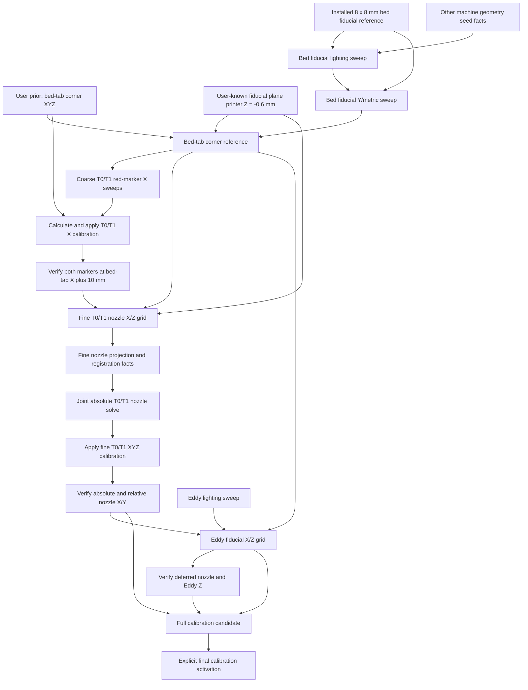

# Vision Calibration Jobs, Facts, and Dependency Graph

## Purpose

This document describes the calibration layer that should sit on top of the
existing Klipper vision-job runtime.

Every vision calibration job has the same three logical phases:

1. generate and run deterministic G-code that acquires a declared set of images
2. analyze only those committed images
3. publish the facts supported by the analysis

The important addition is that facts are versioned inputs to later jobs.
Downstream results bind to exact upstream fact IDs, not merely to names such as
“the current bed calibration.” When an authoritative job publishes replacement
facts, results derived from the replaced facts become stale.

This makes calibration a reproducible dependency graph instead of a sequence of
scripts that happen to share values in `calib.yaml`.

The clean acquisition runtime, synchronized capture, and job directory layout
are described in `VISION_JOB_CONCEPT.md`. This document defines the
calibration-specific graph above that runtime.

### Terminology note

The first observed bed-reference stage uses the four-marker patch now attached
to the underside of the print bed. The printed pattern contains four identical
3 mm concentric-circle fiducials whose centers form an 8 x 8 mm square. The
printed scale was physically checked before installation.

That stage still commands printer **Y** back and forth. The known square gives
an absolute in-plane metric while the commanded motion identifies printer +Y
and measures the image-space Y/parallax vector. The identical square does not
by itself identify printer +X versus -X; the later red-marker X sweep resolves
that remaining sign.

## Design Principles

- Raw images, manifests, sidecars, analysis results, and facts are immutable.
- Re-analysis creates a new analysis run; it never rewrites old facts.
- Relative image registration is preferred. A detector may locate a tight ROI,
  but calibration should come from aligning homologous image content.
- A missing red marker or hidden nozzle rejects that observation, not
  necessarily the whole acquisition.
- Facts carry units, coordinate frames, concrete quality measurements, and
  provenance.
- Do not invent or propagate uncertainty estimates or covariance matrices.
  Store directly observed evidence such as residuals, repeatability,
  correlation, accepted/rejected observations, and sweep coverage.
- Job definitions declare the fact types they require and produce.
- A concrete job manifest binds every requirement to an exact fact ID.
- Only accepted authoritative facts advance the current calibration graph.
- Rejected and diagnostic jobs remain visible but do not invalidate anything.
- Applying calibration is a separate state-changing operation with its own
  provenance. An image analyzer never silently edits live configuration.
- Stale facts remain inspectable. Staleness prevents reuse; it does not erase
  history or automatically roll back an active printer configuration.

## Runtime Model

The word “job” is useful in the UI, but the persisted model should distinguish
acquisition from analysis:

```text
Vision calibration run
  |
  +-- Acquisition run
  |     manifest.json
  |     acquisition.gcode
  |     frames/*.jpg
  |     frames/*.json
  |
  +-- Analysis run 1
  |     result.json
  |     facts.json
  |     overlays/
  |
  +-- Analysis run 2
        result.json
        facts.json
        overlays/
```

An acquisition run is tied to printer motion and camera state. It cannot be
repeated without creating a new acquisition ID.

An analysis run is pure: it consumes one acquisition plus exact upstream facts.
Improved analysis code may analyze the same images again, but it produces a new
analysis ID and new fact set.

The existing job states continue to describe acquisition and the first
analysis:

```text
prepared -> acquiring -> acquired -> analysing -> completed
```

The calibration catalog adds graph-level status:

- `current`: accepted and selected as the current fact set for its scope
- `stale`: accepted, but at least one exact input fact is no longer current
- `superseded`: replaced by a newer accepted fact set with the same semantic
  output and applicability scope
- `rejected`: analysis completed but did not publish usable facts
- `diagnostic`: deliberately non-authoritative and never selected as current

## Calibration Dependency Graph

The intended end-to-end graph is:



The graph contains two kinds of roots:

- observed roots, produced by vision jobs
- versioned seed facts, including the user-defined bed-tab corner printer XYZ,
  the installed bed-fiducial physical reference, the
  fiducial-plane printer-Z coordinate, camera identity, and the
  active Klipper configuration fingerprint

Seed facts use the same provenance and invalidation rules as image-derived
facts. Changing the user-defined bed-tab corner coordinates or a CAD geometry
fact therefore invalidates every downstream fact that used the old fact ID.
Removing, replacing, or repositioning the glued fiducial patch publishes a new
installation fact and similarly invalidates its lighting, bed metric, corner,
and all downstream calibration facts.

## Calibration Stages

### 0. User-defined bed-tab coordinate prior

Before any absolute calibration job can run, the user defines the printer
coordinates of the physical bed-tab corner:

```yaml
bed_tab_corner_prior:
  x_mm: 173.0
  y_mm: -18.0
  z_mm: 0.0
```

This is the current user-defined coordinate identity of the physical corner,
not an image-derived estimate. Its X coordinate is `173 mm`, its Y coordinate
is `-18 mm`, and its Z coordinate defines the `0 mm` bed/print reference
plane. If physical measurement later leads the user to redefine these values,
the replacement uses normal superseding and downstream invalidation.

This is an authoritative initial prior fact:

- `bed.tab_corner.printer_xyz`
- provenance source `user_initial_prior`
- measurement method `user_defined_fixed_reference`
- exact `Z=0` definition
- revision, timestamp, and canonical fact hash

Vision does not discover or silently refine these absolute printer
coordinates. The corner-reference job finds the corresponding pixel and binds
that observation to this prior. Replacing the prior later creates a new fact ID
and makes the corner reference, rough X calibration, fine nozzle calibration,
Eddy geometry, and full calibration candidate stale.

The independent installed-pattern seed fact is:

- `bed.fiducial_patch.physical_reference`
- four white concentric-circle markers on black
- marker outer diameter `3 mm`
- marker centers at patch-local `[3,3]`, `[11,3]`, `[3,11]`, and `[11,11] mm`
- center spacing `8 mm` in both patch axes
- printed scale physically checked by the user
- rigid attachment to the underside of the print bed
- exact source SVG, A4 PDF, manifest hashes, and installation revision

The patch's pixel position, rotation, and relation to printer axes are
deliberately not configuration. They are observed on every applicable run.

### 1. Bed-fiducial lighting and Y/metric scale

#### 1a. Bed-fiducial lighting

Job type:

```text
nozzle_cam_bed_fiducial_lighting_sweep
```

Dependencies:

- current `bed.fiducial_patch.physical_reference`
- camera identity and available fixed camera controls
- configured bed-reference viewing pose and available light pixels

The current live view shows all four rings, but the left side of the black
patch has strong glare. The first calibration acquisition therefore performs a
compact lighting sweep before measuring geometry:

1. capture a short manual-exposure bracket with the lights off
2. test each configured light pixel independently at low intensity
3. test a bounded set of the best asymmetric light combinations
4. refine exposure and intensity around the best candidates
5. capture at least three duplicates of the winner

The adaptive sweep is capped at 24 committed frames. It stops testing settings
that clip a marker or fail to expose all four rings.

Auto exposure may be used only to find a coarse starting point. Every accepted
image uses fixed manual exposure, gain, white balance, and exact per-pixel
light values. The sweep is coordinate-free: it detects candidate
concentric-circle groups over the image and does not contain a configured
fiducial pixel or ROI.

Candidates are scored by the worst of the four markers, not merely by their
mean. The score favors:

- visible outer and inner rings for all four fiducials
- radial symmetry and a stable common center
- white-ring contrast against the black patch
- low clipped-pixel fraction and low veiling glare
- consistent center and template registration across duplicates
- sufficient nearby tab-edge contrast for the following corner job

Produced fact:

- `camera.nozzle_cam.bed_fiducial.lighting_profile`

The fact has role `acquisition_profile`, not `coordinate_system`, and stores
only fixed camera and light settings. Candidate scores, detected ROIs, clipped
fractions, and duplicate measurements remain diagnostics. Replacing this fact
invalidates the bed-fiducial metric and every downstream consumer, because
those analyses bind to the exact illumination under which their images were
acquired.

The job page makes the winner inspectable with a settings contact sheet, score
table or heatmap, clipped-pixel masks, and full-frame overlays showing all four
detected ring centers and their tight ROIs.

#### 1b. Bed-fiducial Y/metric sweep

Job type:

```text
nozzle_cam_bed_fiducial_y_metric
```

Acquisition:

- use the accepted fixed bed-fiducial lighting profile
- move commanded Y back and forth by known distances
- capture all four bed-attached fiducials at each position
- include reversals so backlash or direction-dependent registration can be
  measured
- use the six-frame forward/reverse sequence `[0, 10, 20, 20, 10, 0] mm`
- keep the same camera profile, exposure, gain, white balance, and light values
  for all six frames

Analysis:

- find groups of four concentric-circle candidates consistent with a projective
  image of an 8 x 8 mm square; do not hardcode their image location
- use circle/ring detection only to initialize four tight ROIs
- align each fiducial ROI through forward and reverse frame chains using
  grayscale, CLAHE, and gradient registration
- jointly fit the four marker centers, one local patch-plane homography, and
  image displacement against commanded Y
- use commanded +Y motion to resolve the signed printer-Y image vector
- use the known square metric to recover local physical scale in both in-plane
  directions without assuming that the glued patch is aligned to printer X/Y
- retain the two possible printer-X signs; Stage 3 resolves the sign from
  commanded X motion
- compare the 8 mm printed dimensions with commanded-Y displacement as an
  independent consistency check
- reject low-correlation matches, clipped rings, glare-biased centers,
  direction-dependent outliers, and stationary enclosure features

Produced fact:

- `camera.nozzle_cam.bed_fiducial.local_metric_model`, with role
  `coordinate_system`, containing:
  - the signed two-dimensional image displacement per printer +Y millimetre
  - the local patch-mm-to-image-pixel homography at the reference capture
  - the unresolved pair of possible printer-X image directions
  - exact bindings to the installed physical reference and lighting profile

Scalar scales, inverse scales, angles, correlations, residuals, and individual
marker centers are shown in reports. Only the coordinate-defining model fields
are displayed in the current-facts overview.

This fact establishes an absolute local bed-attached fiducial-plane metric and
signed image-space Y direction. It does not establish an absolute image
origin, the sign of printer X, or the print-plane Z relationship.

### 2. Bed-tab corner reference

Job type:

```text
nozzle_cam_bed_tab_corner
```

Dependencies:

- current accepted bed-fiducial local metric fact
- current user-defined `bed.tab_corner.printer_xyz` prior
- current `bed.fiducial_patch.printer_z_mm` seed

Acquisition:

- capture several duplicates of the bed-tab corner at a fixed safe pose
- keep the four installed fiducials and the tab corner in the same frame
- use a separate bright, glare-friendly corner profile; the low-glare
  fiducial profile is deliberately not reused because it hides the tab side
  edge
- the initial fixed corner setup is the `vision` camera profile with all eight
  light pixels at `0.45`; this setting intentionally permits clipping and
  specular glare where they strengthen the tab-edge geometry
- record the exact corner camera profile and light values in the manifest and
  applicability scope

Analysis:

- find the two tab edges and their intersection
- use edge or line detection only for initial localization
- predict the four-marker location from the accepted local metric model at the
  exact corner-capture Y position; the bright corner image is not required to
  re-detect all four low-glare fiducial rings
- refine the corner by registering all bright duplicates to whichever frame
  gives the strongest semantic tab-edge intersection
- measure the corner relative to that observed patch rather than to a
  hardcoded corner ROI
- bind the observed corner pixel to the exact commanded Y coordinate of the
  corner capture
- project the corner through the accepted bed-plane metric from that capture
  pose

Produced facts:

- `camera.nozzle_cam.partial_bed_coordinate_system`, which binds:
  - the observed corner pixel
  - the exact commanded Y at which that pixel was observed
  - the accepted bed-fiducial local metric model
  - the observed patch-to-corner transform
  - the exact user-prior fact ID
  - the exact fiducial-plane printer-Z fact ID

The observed pixel and the physical prior are deliberately different pieces of
information. The prior Y identifies the physical corner in printer
coordinates; the observed capture Y identifies the bed pose at which the
corner pixel was measured. A downstream image captured at another Y projects
the corner with:

```text
corner_pixel_at_capture =
    observed_corner_pixel
    + bed_metric.image_y_axis_vector_px_per_mm
      * (capture_y_mm - observed_corner_capture_y_mm)
```

Using the prior Y in place of `observed_corner_capture_y_mm` is invalid and
shifts every downstream overlay by the difference between those Y values.

At this point one pixel has an absolute bed X/Y identity, and the image Y basis
is known because the pixel observation is bound to the user’s prior. The local
X scale is already known from the printed square, but the sign of printer X is
still unresolved.

### 3. Coarse red-marker X sweeps

Job type:

```text
idex_tool_red_marker_x_sweep
```

Dependencies:

- current bed-tab corner facts
- current bed-fiducial local metric facts
- current active calibration snapshot

Acquisition:

- run T0 and T1 independently
- command X positions `160, 170, 180, 190, 200, 210 mm`
- use fixed `Y` and commanded `Z=2 mm`
- raise to a safe travel Z before tool changes
- capture one image per commanded position and tool

The red marker is expected to be absent from some images. Absence is an
ordinary rejected observation.

Analysis:

- locate red pixels only to create a tool-local search ROI
- retain detections with acceptable color, shape, and non-clipped bounds
- fit the red-marker image trajectory against commanded X for each tool
- compare T0 and T1 trajectory direction and scale
- choose the printer +X sign from the two candidates in the accepted
  bed-fiducial local metric model
- compare the marker-derived X scale at commanded Z=2 with the
  fiducial-plane metric as a parallax observation
- project the trajectories relative to the bed-tab corner

Produced facts:

- `camera.nozzle_cam.image_x_axis_vector_px_per_mm_at_z2`
- `tool.t0.red_marker_to_bed_tab_x_mm`
- `tool.t1.red_marker_to_bed_tab_x_mm`
- marker visibility intervals and fit quality as diagnostics

The image-axis angle is a derived report value rather than a separate fact.
Stage 4 calibrates each tool independently to the fixed bed-tab corner.

The red marker is suitable for coarse localization because it is easy to find
over a large range. It is not the final nozzle reference.

### 4. Rough X calibration activation and verification

Operation type:

```text
apply_rough_tool_x_calibration
```

Dependencies:

- current `tool.t0.red_marker_to_bed_tab_x_mm`
- current `tool.t1.red_marker_to_bed_tab_x_mm`
- exact current `bed.tab_corner.printer_xyz`
- exact active configuration fingerprint used by the coarse acquisition

Behavior:

- treat neither tool as the absolute X reference
- calibrate T0 and T1 independently to the fixed bed-tab corner at `X=173 mm`
- calculate both corrections from existing facts; this operation requires no
  new acquisition images
- create one atomic candidate changing only `tools.t0.x_endstop` and
  `tools.t1.x_endstop`
- do not change either tool's Y or Z calibration
- record both old values, corrections, new values, source fact IDs, source
  config hash, and generated config fingerprint
- apply only after explicit approval
- restart Klipper and require a ready state

For each tool `t`, let:

- `B_x = 173 mm`, from `bed.tab_corner.printer_xyz`
- `X_ref,t` be the `reference_commanded_x_mm` stored in the tool's Stage 3 fact
- `d_t` be its signed `red_marker_to_bed_tab_x_mm.offset_mm`, positive toward
  printer +X

The Stage 3 observation places the marker at printer coordinate
`B_x + d_t` while the tool was commanded to `X_ref,t`. Therefore:

```text
rough_x_residual_t = B_x + d_t - X_ref,t
new_x_endstop_t    = old_x_endstop_t + rough_x_residual_t
```

Changing an endstop by `rough_x_residual_t` moves that tool's physical marker
by the opposite amount at the same commanded coordinate. After activation,
the marker is therefore at physical X=`X_ref,t` when commanded to `X_ref,t`;
with the measured linear X mapping, commanding the tool to X=`B_x` places the
marker at the bed-tab corner. This calculation is performed separately for T0
and T1. Their mutual alignment is a consequence, not the calibration
reference.

Produced activation fact:

- `calibration.rough_tool_x.active_snapshot`

Verification job:

```text
verify_rough_tool_x_at_bed_tab_plus_10
```

The marker is only partially visible at X=`173 mm`, so verification uses a
defined `+10 mm` offset from the calibration anchor. At the same safe viewing
Y/Z pose used by Stage 3, it commands T0 to `X=183`, captures the marker and
bed-tab corner, then safely changes tools, commands T1 to `X=183`, and captures
the same references.

Let `p_corner` be the observed bed-tab corner pixel and `v_x` be
`camera.nozzle_cam.image_x_axis_vector_px_per_mm_at_z2`. The expected marker
position is:

```text
p_expected = p_corner + 10 mm * v_x
```

Verification checks both absolute and relative conditions:

- each marker is `10 mm` toward printer +X from the bed-tab corner when
  projected onto the measured image-X axis
- the T0 and T1 markers have the same image-X coordinate
- each marker is sufficiently visible for a reliable fit

The cross-tool agreement alone is insufficient because both markers could
share the same absolute offset from `p_expected`.

The prior's `Y=-18` and `Z=0` define the corner's printer coordinates; they are
not the acquisition pose. Verification retains the safe camera pose and never
commands Z=0.

The verification produces `calibration.rough_tool_x.verified`, including the
separate T0 and T1 residuals relative to the expected `+10 mm` position and a
marker-coincidence residual. This remains a coarse red-marker gate, not the
final nozzle X calibration.

The fine X/Z job requires both the active rough-X snapshot and its accepted
verification fact. This prevents a fine sweep from being generated against
coordinates that were measured but never activated.

### 5. Fine T0/T1 nozzle X/Z grid

Job type:

```text
idex_nozzle_fine_xz_grid
```

Dependencies:

- bed-fiducial local metric and lighting facts
- bed-tab corner and bed reference-plane facts
- red-marker X-axis and per-tool marker-offset facts
- active and verified rough-X calibration snapshot
- fixed nozzle lighting/camera profile

The path is calculated from the current corner prior rather than hardcoded in
printer coordinates. With the current `bed_tab_x=173 mm`, the default X row is:

```text
bed_tab_x + [10, 13, 16, 19, 22, 25] mm
          = [183, 186, 189, 192, 195, 198] mm
```

The initial `1` through `5 mm` Z span proved too short for a reliable
perspective fit. The fast default doubles the measured span while preserving
the same image count:

```text
Z = [1, 3, 5, 7, 9] mm
```

This gives an 8 mm measured span and still keeps the conservative minimum at
Z=`1 mm`. A full rectangular acquisition would contain 60 frames. The fast
default remains a 40-frame sparse tensor grid:

- full six-position X rows at Z=`1`, `5`, and `9 mm`: 36 frames for two tools
- the center X position at Z=`3` and `7 mm`: 4 additional frames
- snake the X direction between rows
- raise to Z=`9 mm` before every tool change
- never command below Z=`1 mm`

The full rectangular grid remains configurable for later high-precision work.
The same nominal printer-coordinate path is acquired for T0 and T1.

#### Coordinate-free nozzle localization

The nozzle ROI is not a configured pixel rectangle and no marker-to-nozzle
pixel offset is hardcoded.

1. Use the current red-marker trajectory model to identify the tool-local red
   marker. Do not select the largest red component: T1 has other red wiring that
   can be larger than the marker.
2. Search a broad image-size-relative region around the marker for the dark
   outer ring and use it only as a coarse tool-local locator.
3. Inside the located assembly, identify the actual nozzle tip/central orifice.
   The ring is physically about 3 mm above the nozzle tip and therefore cannot
   be the calibrated feature or the scale reference.
4. Circle, ellipse, or ring detection may propose the assembly center only. A
   separate tip detector must identify the central tip feature in every
   reference image.
5. Derive a very small square ROI centered on the observed nozzle tip. Its side
   should normally be only 20–30% of the observed outer-ring diameter and must
   exclude the outer-ring edge, red marker, heater structure, and bed edge.
   This relative size is resolved from each observed tool image; no pixel
   center or fixed pixel rectangle is configured.
6. Track every tip candidate across the X/Z grid.
7. Select the candidate whose motion follows commanded X/Z, whose appearance
   changes smoothly with Z, and whose T0/T1 tip images register consistently.
8. Use only the small tip ROI for authoritative registration, scale, and
   projection measurements. The outer ring remains visible in diagnostic
   overlays solely to show how the tip ROI was localized.

A frame in which the nozzle is hidden, clipped, or ambiguously matched is
excluded. It cannot contribute a calibration fact.

Tip registration must reject a match when the optimized ROI drifts onto the
outer ring. A valid overlay shows the small ROI and its center attached to the
nozzle tip in every frame, plus a separately colored coarse ring locator. This
makes the physical feature identity visually auditable.

#### Registration graph

The authoritative measurements are forward/reverse relative registrations:

- neighboring X images of the same tool at the same Z
- neighboring Z images of the same tool at the center X
- T0/T1 images at corresponding commanded X/Z poses
- duplicate or loop-closing edges where the sparse grid provides them

Use grayscale, CLAHE, and gradient representations. Each edge records
translation, isotropic scale, correlation, forward/reverse disagreement,
boundary status, and rejection reason. The graph is solved jointly after weak
or inconsistent edges are removed.

For each tool, use the three-observable nozzle state

```text
o = [image_x, image_y, log(apparent_scale)]
```

and fit a local projection model

```text
image_position(x, z)
  = p0 + Jx0 * (x - x_ref)
       + Jz  * (z - z_ref)
       + Jxz * (x - x_ref) * (z - z_ref)

Jx(z) = Jx0 + Jxz * (z - z_ref)
```

The bilinear term is the measured X parallax change with Z. The log-scale
observable supplies an independent Z discriminator for the cross-tool solve.
The bed-fiducial local metric supplies the image direction for printer Y and
the observed fiducial-plane directional scale ratio. This stage fits the
tool-local projection and registration evidence. It does not by itself declare
an absolute nozzle pose or an endstop correction. The absolute solve and its
physical plausibility gates belong to Stage 5.1.

#### Bed-plane Z anchoring

The original proposal was to declare nozzle Z=0 where the magnitude of the
nozzle X scale equals the old bed-tab Y scale. That equality is not generally
valid for an oblique camera: the local image scale can differ by world
direction even at one physical plane.

Write the comparison explicitly as:

```text
Sx_nozzle(z_zero) = Sx_bed_print
Sx_bed_print      = Rxy_bed_print * Sy_bed_print
```

The installed 8 x 8 mm square now measures both in-plane directions, so the
bed-plane directional scale ratio is observed instead of assumed. The
commanded Y sweep determines printer Y; the square's known Euclidean metric
determines the perpendicular X scale; and the red-marker X sweep resolves its
sign.

The printed patch is attached to the underside of the bed rather than to the
print surface. Its local metric is therefore measured at the fiducial plane.
The user-known coordinate seed is:

- `bed.fiducial_patch.printer_z_mm = -0.6`
- printer Z=0 is the bed print-reference plane
- the derived displacement from the fiducial plane to the print plane is
  therefore +0.6 mm

The fitted X-scale-versus-Z model may transport local vectors between nearby
planes, but equality of one nozzle X-motion vector with one bed X-motion vector
is not sufficient to solve nozzle Z. Image X scale also changes with camera
depth, including a nozzle's printer-Y position, and the vector angle contains
the same projective coupling. Stage 5 therefore must not attribute the complete
bed/nozzle vector difference to Z.

Produced coordinate-system fact:

- `camera.nozzle_cam.nozzle_tip.projection_model`

The projection fact stores the fitted X vector at the reference Z and its
vector-valued Z slope. ROI geometry, correlations, fit residuals, accepted
registration edges, any scalar-equality extrapolation, sweep coverage, and
outliers are diagnostic fields or analysis artifacts. The exact accepted
registrations remain available to the Stage 5.1 joint solve.

#### Finding from the first live grid

The first live implementation produced:

```text
T0 commanded_z_at_print_plane_mm = -4.109041
T1 commanded_z_at_print_plane_mm = -8.546839
```

These values are physically implausible and must not drive a calibration
candidate. For T1, for example, the fitted vectors were approximately:

```text
Jx_nozzle(z=3) = [9.121, -0.032] px/mm
dJx_nozzle/dz  = [-0.0505, 0.0120] px/mm/mm
Jx_bed(z=0)    = [9.837,  0.394] px/mm
```

The one-dimensional line `Jx_nozzle(z)` does not pass through the measured bed
vector. The old solver returned the least-squares closest Z without rejecting
the large remaining vector mismatch. It thereby interpreted printer-Y/camera
depth and feature-plane differences as Z parallax.

The overlay also shows that the current broad template follows the circular
outer ring as a whole. The ring is about 3 mm above the actual nozzle tip. It
is useful localization evidence, but its motion and apparent scale describe
the wrong physical plane. The authoritative template must instead be the very
small tip-centered ROI defined above.

Consequently, the corresponding absolute per-tool facts from that analysis
are invalid as calibration inputs. A corrected implementation must publish a
new Stage 5 definition and re-analyze or reacquire the grid. It must not retain
the current absolute nozzle facts as current graph heads.

### 5.1 Verify and apply resulting calibration

This stage separates three operations:

```text
calculate_fine_tool_xyz_calibration
apply_fine_tool_xyz_calibration
verify_fine_tool_xy_calibration
```

The calculation consumes the accepted Stage 5 projection and registration
evidence. Application changes `calib.yaml`. Verification uses a new, short
image job after the changed configuration is active.

#### Dependencies

- current bed-fiducial physical reference, metric, and printer-Z facts
- current bed-tab corner coordinate system
- accepted Stage 5 nozzle-tip registration graph and projection model
- exact active rough-X snapshot under which the Stage 5 images were acquired
- exact current `calib.yaml` and generated printer-configuration fingerprint

The red-marker facts remain useful acquisition provenance and coarse locator
inputs. They are not calibration inputs once the fine nozzle solve is accepted.

#### Joint absolute solve

The absolute solve must fit one common camera geometry and two independent tool
offset vectors. It uses:

- the known bed-fiducial X/Y geometry in the plane at printer Z=`-0.6 mm`
- the observed bed-tab corner bound to `[173, -18, 0] mm`
- known commanded X/Z differences in each tool's fine grid
- tight T0/T1 nozzle registrations at corresponding commanded poses
- the nozzle feature's image position and apparent-scale observations

The solver must account jointly for printer Y, printer Z, camera depth, and
perspective. It must not solve Z by forcing:

```text
Jx_nozzle(z) = Jx_bed
```

in isolation. If the available X/Z grid and bed plane do not identify all
parameters cleanly, the solve rejects and requests a small explicit nozzle-Y
dither acquisition. It never invents the missing degree of freedom.

For each tool `t`, the accepted result stores:

```text
reference_commanded_xyz_mm_t
measured_nozzle_xyz_mm_t
```

both in the printer coordinate system. The endstop residual is derived as:

```text
r_t = measured_nozzle_xyz_mm_t - reference_commanded_xyz_mm_t
```

Changing an endstop value by `r_t` moves that tool's physical nozzle by
`-r_t` at the same commanded coordinate. The candidate is therefore:

```text
new tools.t0.x_endstop = old tools.t0.x_endstop + r_t0.x
new tools.t0.y_endstop = old tools.t0.y_endstop + r_t0.y
new tools.t0.z_endstop = old tools.t0.z_endstop + r_t0.z

new tools.t1.x_endstop = old tools.t1.x_endstop + r_t1.x
new tools.t1.y_endstop = old tools.t1.y_endstop + r_t1.y
new tools.t1.z_endstop = old tools.t1.z_endstop + r_t1.z
```

T0 and T1 are each calibrated absolutely to the measured bed coordinate
system. Neither is treated as the reference tool. T1-minus-T0 XYZ is derived
for the report from the two absolute poses; it is not stored as a correction
fact.

#### Calculation gates

No candidate is produced unless:

- the tracked feature is explicitly identified as the nozzle tip, not merely a
  broad tool-face feature
- the joint bed/tool camera model fits both tools with compatible geometry
- the fitted print-plane command lies near commanded Z=0 and no farther than
  one grid step outside the measured Z range
- the predicted and observed 2-D motion vectors agree after the full
  projective solve; a nearest-point Z with a large remaining vector residual is
  rejected
- leaving out any one X row or Z level does not change the correction enough to
  reverse or qualitatively alter it
- all six proposed endstop changes lie inside declared mechanical and
  configuration safety bounds

The current `-4.109 mm` and `-8.547 mm` results fail these gates.

#### Candidate, application, and superseding rough X

The calculation produces:

- `tool.t0.nozzle_to_bed_tab_xyz_mm`
- `tool.t1.nozzle_to_bed_tab_xyz_mm`
- `calibration.fine_tool_xyz.candidate`

The candidate contains a complete copy of the current calibration with only
`tools.t0.{x,y,z}_endstop` and `tools.t1.{x,y,z}_endstop` changed. It records
the exact old/new values, source fact IDs, source `calib.yaml` hash, and active
printer fingerprint.

Application:

1. creates a recoverable remote backup
2. updates the six values atomically in `calib.yaml`
3. regenerates `printer.cfg`
4. validates generated consistency and the exact scoped diff
5. deploys the synchronized files
6. restarts Klipper and requires `ready`
7. homes safely, while making no low-Z verification move

Successful application publishes
`calibration.fine_tool_xyz.active_snapshot`. It supersedes
`calibration.rough_tool_x.active_snapshot` as the authoritative tool-coordinate
snapshot. The old snapshot and red-marker measurements remain historical
provenance but cannot satisfy downstream current-calibration requirements.

The calculated T0 and T1 Z endstops are recorded and activated with this
snapshot, but their physical nozzle-to-bed interpretation remains explicitly
`pending_eddy_verification`. Until Stage 7 resolves that status, no
contact-near-Z workflow may claim a verified nozzle Z zero.

#### Independent X/Y verification

The post-activation verification is a new acquisition, not a re-analysis of
the calibration grid. At a safe central Z it captures both tools at:

- one common central commanded X/Y pose
- one positive X dither from that pose
- one positive Y dither from that pose

The poses are derived from the bed-tab coordinate and active travel limits.
Both tools receive identical commanded coordinates. Tool changes occur only at
safe Z.

Analysis uses the accepted tight nozzle-tip templates and the current bed
coordinate model to report:

- T0 absolute X and Y residuals
- T1 absolute X and Y residuals
- derived T1-minus-T0 X and Y offsets
- observed X- and Y-dither direction and scale
- before/after overlays at every common pose

Passing requires both absolute residuals and the relative T0/T1 residuals to
meet the job's declared direct-measurement limits. Mutual T0/T1 alignment alone
is insufficient: both tools could otherwise share the same absolute error.

The verification publishes `calibration.fine_tool_xy.verified`. It does not
verify Z. It reports the active Z values and their
`pending_eddy_verification` status so the omission is visible rather than
implicit.

### 6. Eddy lighting

Job type:

```text
eddy_fiducial_lighting_sweep
```

This job is independent of nozzle calibration except for the safe pose needed
to see the Eddy assembly. It produces:

- fixed camera exposure
- exact per-pixel light values
- fiducial ROI
- duplicate correlation and center-repeatability quality

The accepted lighting fact can be produced early and reused by the final Eddy
geometry job. Re-running and accepting a new Eddy lighting job invalidates Eddy
geometry facts but does not invalidate nozzle calibration facts.

### 7. Eddy fiducial X/Z grid

Job type:

```text
eddy_fiducial_xz_grid
```

Dependencies:

- current accepted absolute T0/nozzle calibration fact
- current fine-tool XYZ active snapshot
- current fine-tool X/Y verification fact
- bed-tab coordinate and bed reference-plane facts
- current accepted Eddy lighting facts
- active configuration fingerprint

Acquisition:

- select T0
- use the accepted fixed Eddy lighting
- work in the known viewing region around commanded `X=230 mm`
- sweep X and Z around the visible fiducial
- capture duplicates at the central pose

Analysis:

- use the concentric-ring/cross detector only to establish the first tight ROI
- register neighboring fiducial images relatively across X and Z
- fit the same camera scale/parallax model used by the nozzle grid
- compare the fitted fiducial position directly with the accepted T0 nozzle
  reference

Produced facts:

- `eddy.fiducial_to_t0_nozzle_xyz_mm`
- `eddy.fiducial_plane_to_bed_plane_mm`
- `eddy.fiducial.repeatability`
- optional `eddy.coil_plane_to_fiducial_plane_mm` from a separate CAD/metrology
  seed fact

There is deliberately no `eddy.fiducial_to_bed_tab_xyz_mm` fact. That vector
would only compose `eddy.fiducial_to_t0_nozzle_xyz_mm` with the accepted T0
nozzle-to-bed reference, so storing it would duplicate information and create
an unnecessary invalidation target. Reports may calculate that composed vector
on demand while retaining the exact source fact IDs.

The visible fiducial and the electrical sensing plane must not be assumed to be
identical unless an explicit zero correction fact says so.

### 8. Full calibration candidate

Operation type:

```text
assemble_full_vision_calibration
```

Dependencies:

- accepted absolute fine nozzle fact set
- active fine-tool XYZ snapshot and X/Y verification fact
- accepted Eddy geometry fact set
- completed nozzle/Eddy Z verification
- all exact seed facts used by those results
- current base configuration fingerprint

Output:

- complete `calib.yaml` candidate
- exact old/new values
- full input fact binding
- generated printer configuration fingerprint
- residual and quality summary

The resulting calibration knows:

- bed reference-plane Z in the images
- image X and Y directions and local scale
- T0 nozzle position relative to the bed reference
- T1 nozzle X/Y/Z offsets relative to T0
- Eddy fiducial X/Y/Z offset relative to T0
- optional Eddy coil-plane correction relative to the visible fiducial

Final activation is explicit and produces a new active calibration snapshot.

## Data Structures

### User-prior fact

The bed-tab XYZ prior should be stored as a normal immutable fact set rather
than as an undocumented constant in an analyzer:

```yaml
schema_version: 1
fact_set_id: sha256:...
status: accepted
authoritative: true
producer:
  source: user_initial_prior
  recorded_at_utc: ...
applicability:
  printer: menderpi
facts:
  - fact_id: sha256:...
    fact_type: bed.tab_corner.printer_xyz
    value:
      x: 173.0
      y: -18.0
      z: 0.0
    unit: mm
    coordinate_frame: printer_xyz
    definition:
      z: bed_print_reference_plane
    provenance:
      entered_by: user
      measurement_method: user_defined_fixed_reference
```

These are the current authoritative prior values. Changing them does not
mutate the existing fact: it publishes a new prior fact set and triggers normal
downstream invalidation.

### Installed bed-fiducial physical-reference fact

The printed and attached square is also represented as an immutable seed fact:

```yaml
schema_version: 1
fact_set_id: sha256:...
status: accepted
authoritative: true
producer:
  source: user_installed_physical_reference
  recorded_at_utc: 2026-07-30T...
applicability:
  printer: menderpi
facts:
  - fact_id: sha256:...
    fact_type: bed.fiducial_patch.physical_reference
    role: coordinate_system
    value:
      pattern: four_concentric_circles
      outer_diameter_mm: 3.0
      centers_patch_xy_mm:
        - [3.0, 3.0]
        - [11.0, 3.0]
        - [3.0, 11.0]
        - [11.0, 11.0]
      center_spacing_xy_mm: [8.0, 8.0]
      substrate_plane: print_bed_underside
      rigid_to: print_bed
      installation_revision: 1
      printed_scale_checked: true
    source_artifacts:
      svg: resources/vision_fiducials/bed_y_four_fiducials.svg
      pdf: resources/vision_fiducials/bed_y_four_fiducials_a4.pdf
      manifest: resources/vision_fiducials/bed_y_four_fiducials.json
    coordinate_frame: fiducial_patch_xy
  - fact_id: sha256:...
    fact_type: bed.fiducial_patch.printer_z_mm
    role: coordinate_system
    value: -0.6
    unit: mm
    coordinate_frame: printer_z
    definition:
      bed_print_reference_plane_z_mm: 0.0
      meaning: fiducial_plane_is_0.6_mm_below_print_plane
    provenance:
      entered_by: user
      measurement_method: known_physical_bed_geometry
```

The fact defines geometry and physical identity, not image location. Removing,
re-gluing, rotating, or replacing the patch requires a new installation
revision even when the printed artwork is unchanged. The new fact then makes
the lighting profile, bed metric, and all downstream consumers stale.

The direct printer-Z fact records the known fiducial plane at `-0.6 mm`. The
corresponding +0.6 mm displacement from the fiducial plane to the print plane
is derived and is not published as a second, ambiguously signed fact.

### Job-type definition

Job types should be registered declaratively, for example in
`vision_job_types.yaml`:

```yaml
schema_version: 1
job_type: idex_nozzle_fine_xz_grid
definition_version: 6
acquisition_generator: vision_calibration:build_fine_xz_job
analyzer: vision_calibration:analyze_fine_xz_job
requires:
  - fact_type: camera.nozzle_cam.bed_fiducial.local_metric_model
    current: true
  - fact_type: camera.nozzle_cam.partial_bed_coordinate_system
    current: true
  - fact_type: camera.nozzle_cam.image_x_axis_vector_px_per_mm_at_z2
    current: true
  - fact_type: tool.t0.red_marker_to_bed_tab_x_mm
    current: true
  - fact_type: tool.t1.red_marker_to_bed_tab_x_mm
    current: true
  - fact_type: calibration.rough_tool_x.active_snapshot
    current: true
  - fact_type: calibration.rough_tool_x.verified
    current: true
produces:
  - camera.nozzle_cam.nozzle_tip.projection_model
  - tool.t0.nozzle_to_bed_tab_xyz_mm
  - tool.t1.nozzle_to_bed_tab_xyz_mm
safety:
  required_homed_axes: xyz
  require_idle: true
  require_heaters_off: true
  minimum_commanded_z_mm: 1.0
```

The registry declares interfaces and safety. The generated manifest records the
resolved parameters and exact inputs for one run.

### Acquisition manifest

Extend the existing immutable `manifest.json` with fact bindings:

```json
{
  "schema": "vision-calibration-acquisition-manifest",
  "schema_version": 1,
  "job_id": "idex_nozzle_fine_xz_grid_20260729T180000Z",
  "job_type": "idex_nozzle_fine_xz_grid",
  "definition_version": 5,
  "manifest_hash": "sha256:...",
  "gcode_hash": "sha256:...",
  "active_config_fingerprint": "sha256:...",
  "input_facts": [
    {
      "requirement": "bed_fiducial_metric",
      "fact_name": "camera.nozzle_cam.bed_fiducial.local_metric_model",
      "fact_set_hash": "sha256:...",
      "fact_definition_version": 1
    },
    {
      "requirement": "rough_x_active_snapshot",
      "fact_name": "calibration.rough_tool_x.active_snapshot",
      "fact_set_hash": "sha256:...",
      "fact_definition_version": 5
    }
  ],
  "grid_reference": {
    "bed_tab_x_mm": 173.0,
    "x_offsets_from_bed_tab_mm": [10, 13, 16, 19, 22, 25],
    "z_positions_mm": [1, 3, 5, 7, 9],
    "minimum_commanded_z_mm": 1.0
  },
  "frames": []
}
```

Preparing a job fails if a required current fact cannot be resolved. Once
prepared, the bindings never change. Starting the job rechecks that the bound
facts and active configuration are still current.

### Analysis run

`analysis/<analysis_run_id>/analysis.json` records how images became results:

```json
{
  "schema_version": 1,
  "analysis_run_id": "sha256:...",
  "acquisition_job_id": "idex_nozzle_fine_xz_grid_20260729T180000Z",
  "analyzer": "vision_calibration:analyze_fine_xz_job",
  "analyzer_version": "git:...",
  "input_manifest_hash": "sha256:...",
  "input_fact_ids": ["sha256:...", "sha256:..."],
  "started_at_utc": "...",
  "completed_at_utc": "...",
  "result_path": "result.json",
  "result_sha256": "sha256:..."
}
```

`result.json` remains diagnostic and may be large. It contains every
registration, residual, rejected observation, overlay link, model parameter,
and directly measured quality value.

### Fact set

Facts from one accepted analysis are published atomically as a fact set:

```json
{
  "schema": "vision-calibration-fact-set",
  "schema_version": 1,
  "fact_set_hash": "sha256:...",
  "job_id": "idex_nozzle_fine_xz_grid_20260729T180000Z",
  "analysis_run_id": "sha256:...",
  "accepted": true,
  "publication_eligible": true,
  "applicability_hash": "sha256:...",
  "facts": [
    {
      "name": "tool.t1.nozzle_to_bed_tab_xyz_mm",
      "definition_version": 5,
      "role": "coordinate_system",
      "dependencies": [],
      "value_items": [
        {"field": "xyz_mm", "role": "coordinate_system"}
      ],
      "value": {"xyz_mm": [173.02, -18.04, 0.08]}
    }
  ]
}
```

Fact IDs are hashes of canonical fact content plus provenance. Numerical facts
must always declare units and coordinate frame. Image coordinates must state
their origin and axis convention.

### Fact catalog

Immutable job directories are the source of truth. A generated catalog is a
rebuildable index:

```json
{
  "schema_version": 1,
  "heads": {
    "bed.fiducial_patch.physical_reference": "sha256:...",
    "camera.nozzle_cam.bed_fiducial.lighting_profile": "sha256:...",
    "camera.nozzle_cam.bed_fiducial.local_metric_model": "sha256:...",
    "bed.tab_corner.printer_xyz": "sha256:...",
    "tool.t1.nozzle_to_bed_tab_xyz_mm": "sha256:..."
  },
  "fact_sets": {
    "sha256:...": {
      "status": "current",
      "job_id": "...",
      "depends_on": ["sha256:..."],
      "supersedes": "sha256:..."
    }
  },
  "reverse_dependencies": {
    "sha256:upstream": ["sha256:downstream"]
  }
}
```

The first implementation can rebuild this file by scanning job directories.
It does not require a database.

### Calibration snapshot

Applying rough or final calibration creates an immutable snapshot:

```yaml
schema_version: 1
snapshot_id: sha256:...
kind: rough_tool_x
status: active
base_config_fingerprint: sha256:...
source_fact_ids:
  - sha256:...
changes:
  tools.t0.x_endstop:
    old: ACTIVE_T0_X_ENDSTOP_MM
    correction: DERIVED_T0_ROUGH_X_RESIDUAL_MM
    new: DERIVED_T0_X_ENDSTOP_MM
  tools.t1.x_endstop:
    old: ACTIVE_T1_X_ENDSTOP_MM
    correction: DERIVED_T1_ROUGH_X_RESIDUAL_MM
    new: DERIVED_T1_X_ENDSTOP_MM
generated_config_fingerprint: sha256:...
applied_at_utc: ...
```

The active printer configuration and the vision fact graph can therefore be
compared exactly.

## Dependency Resolution and Invalidation

### Publishing new facts

When an authoritative analysis finishes:

1. validate its manifest, images, sidecars, input fact hashes, and analyzer
   output
2. write the immutable fact set
3. select each produced semantic fact as the new head for its applicability
   scope
4. mark the previous head as `superseded`
5. traverse reverse dependencies from the superseded fact IDs
6. mark every dependent fact set and unapplied candidate as `stale`
7. mark active calibration snapshots as `provenance_stale` when appropriate
8. refresh `/vision/`

A rejected analysis publishes diagnostics but no current facts, so it
invalidates nothing.

An explicitly diagnostic run writes `authoritative: false`. It can compare
algorithms without changing graph heads or invalidating downstream work.

### Stale active calibration

If an upstream fact is replaced after a calibration was applied:

- the loaded printer configuration remains active
- the snapshot is visibly marked `provenance_stale`
- no automatic rollback occurs
- downstream calibration jobs requiring current facts are blocked
- the UI explains exactly which input fact was superseded

This separates machine safety from provenance correctness.

### Re-analysis

Re-analyzing old images:

- creates a new analysis run
- binds the same acquisition manifest and original upstream fact IDs
- may publish a new fact set
- can become current only if its applicability still matches the printer and
  the user permits authoritative publication

The analyzer must never silently reinterpret old images using newer calibration
facts that were not bound in the original manifest.

### Cycles

Job-type dependencies must form a directed acyclic graph. Calibration activation
breaks the apparent measurement/application loop:

```text
coarse images -> rough correction fact -> active snapshot -> fine images
```

The fine job depends on the new active snapshot, not on itself.

## UI at `/vision/`

The current job pages remain useful. Add a calibration graph view showing:

- each job type and whether it is ready, blocked, running, current, stale, or
  rejected
- the exact current fact set for each stage
- dependencies and the reason a stage is blocked
- which downstream facts became stale after a rerun
- active calibration snapshots and provenance state
- a recommended “next runnable job”

Each job page should show:

- acquisition manifest and frame progress
- bound input facts with links to their producing jobs
- analysis runs for the acquisition
- produced facts and their current/stale status
- downstream consumers
- overlays and rejected observations
- candidate calibration changes, if any

The UI may provide explicit actions:

- prepare/run a ready acquisition job
- re-analyze an acquisition diagnostically
- publish an accepted diagnostic analysis as authoritative
- generate a calibration candidate
- activate a candidate after confirmation

No page should silently apply calibration because analysis completed.

## Implementation Plan

### 1. Add the fact and graph core

- define schemas for job-type definitions, analysis runs, fact sets, the fact
  catalog, and calibration snapshots
- implement canonical hashing and schema validation
- implement catalog rebuilding by scanning existing job directories
- implement exact dependency binding and cycle detection
- implement staleness propagation

### 2. Establish the clean job runtime

- start manifests, analyses, fact sets, publications, and the catalog at schema
  version 1
- retain only generated G-code, synchronous framebuffer capture, camera
  profiles, and Moonraker execution as low-level infrastructure
- write immutable analysis runs into versioned analysis subdirectories
- reject previous manifests, flat fact files, aliases, and historical job
  layouts

### 3. Implement the bed reference foundation

- add the user-editable, versioned bed-tab corner XYZ prior; require explicit
  X/Y values and define Z as `0 mm`
- publish the installed four-marker physical-reference fact from the checked
  SVG/PDF geometry and installation revision
- implement the compact coordinate-free bed-fiducial lighting sweep
- implement the six-frame bed-fiducial Y/metric sweep
- recover the local patch homography, signed printer-Y vector, both in-plane
  scale magnitudes, and unresolved printer-X sign
- implement bed-tab corner acquisition and duplicate registration
- bind the observed corner pixel and patch-relative transform to the exact
  user-prior and metric fact IDs
- publish the user-known `bed.fiducial_patch.printer_z_mm = -0.6` seed fact
- expose lighting, metric, and corner stages and their dependency state in
  `/vision/`

### 4. Implement and activate rough X

- implement the sparse T0/T1 red-marker sweep
- tolerate missing-marker images
- resolve the printer-X sign left ambiguous by the symmetric four-marker square
- calculate independent T0 and T1 corrections against the current
  `bed.tab_corner.printer_xyz` X coordinate
- produce and explicitly apply one atomic candidate changing only
  `tools.t0.x_endstop` and `tools.t1.x_endstop`
- add the two-frame X=`183 mm` verification job that checks each marker at the
  predicted `+10 mm` image-X offset from the corner and compares the two
  marker image-X coordinates

### 5. Implement the fine nozzle model

- generate the local X/Z grid from the accepted bed corner and rough-X
  snapshot
- use the 40-frame sparse grid over Z=`[1, 3, 5, 7, 9] mm`
- locate the outer ring only coarsely, then build pairwise registrations from
  the very small observed nozzle-tip ROI
- reject registration tracks that drift from the tip onto the ring, which is
  about 3 mm above the target plane
- solve the registration graph and camera model jointly
- transport the observed fiducial-plane metric to printer Z=0 using the exact
  physical plane-offset seed
- publish the nozzle projection and registration fact with measured
  fit-quality data

### 5.1 Calculate, apply, and verify fine tool calibration

- jointly solve camera perspective, nozzle X/Y position, and nozzle Z from the
  bed-plane geometry and both tool-local X/Z grids
- reject the scalar vector-equality shortcut and any result requiring excessive
  extrapolation beyond the measured Z span
- produce absolute T0 and T1 nozzle facts and a six-value `calib.yaml`
  candidate
- apply both tools' X/Y/Z endstop changes atomically and supersede the rough-X
  active snapshot
- run the independent common-pose plus X/Y-dither verification job
- publish fine X/Y verification while leaving physical Z verification pending
  for the Eddy stage

### 6. Implement Eddy geometry

- expose the existing Eddy lighting sweep as a fact-producing job
- implement the T0 Eddy X/Z grid around `X=230`
- publish the fiducial-plane-to-bed height and fiducial-to-nozzle XYZ facts
- combine with an explicit fiducial-to-coil-plane seed fact

### 7. Assemble and activate full calibration

- generate complete candidates from exact current fact IDs
- verify source and generated config fingerprints
- deploy only through an explicit activation operation
- retain rollback snapshots and show provenance state in `/vision/`

## Tests

Core graph tests:

- canonical hashes are stable
- missing requirements block job preparation
- manifests bind exact current fact IDs
- dependency cycles are rejected
- an accepted authoritative replacement marks downstream fact sets stale
- rejected and diagnostic jobs invalidate nothing
- stale active snapshots remain active but cannot satisfy current-fact
  requirements
- rebuilding the catalog from immutable job directories is deterministic

Job tests:

- generated frame order and G-code match each declared sweep
- no frame is commanded below the job safety minimum
- tool changes occur only at safe travel Z
- the lighting sweep finds a low-glare fixed profile without a configured
  fiducial pixel or ROI
- lighting selection requires all four rings and scores the worst marker rather
  than accepting three good markers and one clipped marker
- four identical concentric-circle markers are grouped as an 8 x 8 mm square
  under translation, rotation, perspective, and image-size changes
- the bed metric recovers a known local homography and signed Y vector from the
  six-frame forward/reverse sweep
- the symmetric square leaves only the intended X-sign ambiguity, and the
  commanded red-marker X sweep resolves it
- stationary enclosure circles, glare blobs, clipped rings, and inconsistent
  four-marker groups are rejected
- missing red-marker frames are excluded without inventing detections
- the ring locator finds the tool assembly, but only a small tip-centered ROI
  contributes authoritative registration measurements
- synthetic and real-image overlays reject a template centered on the outer
  ring or another feature plane above the nozzle tip
- tight neighboring-image registration recovers synthetic X/Z transforms
- outlier registration edges are rejected before model fitting
- the rough-X calculation recovers the correction sign independently for T0
  and T1 from the bed-tab prior, marker offset, and reference commanded X
- the rough-X candidate changes both tool X endstops atomically and no Y/Z
  value
- rough-X verification rejects a pair of mutually aligned markers when both
  differ from the expected `+10 mm` image-X offset from the bed-tab corner
- fine correction signs are recovered correctly
- the fast fine grid spans Z=`1` through `9 mm` without commanding below
  Z=`1 mm`, and tool changes occur at the declared safe upper Z
- the absolute solve rejects a nearest-point vector match when the remaining
  2-D vector residual is incompatible, even if the returned scalar Z lies
  inside a broad numeric range
- the fine candidate updates both tools' X/Y/Z endstops atomically and
  supersedes, rather than composes with, rough X
- post-activation X/Y verification checks absolute bed-referenced residuals as
  well as derived T1-minus-T0 residuals
- absolute nozzle Z remains blocked if the required current
  `bed.fiducial_patch.printer_z_mm` seed is absent
- with the current `-0.6 mm` seed, the measured directional bed metric is
  transported to Z=0
  without assuming `Sx=Sy`
- fine-model acceptance fails when the usable observations no longer span the
  declared minimum X and Z ranges
- Eddy lighting and geometry facts invalidate only their true consumers

Provenance tests:

- changing camera identity, image size, profile, CAD geometry hash, or active
  config fingerprint prevents accidental fact reuse
- replacing or repositioning the installed fiducial patch makes its lighting,
  bed metric, corner, and every downstream consumer stale
- replacing the accepted bed-fiducial lighting profile invalidates the metric
  and its consumers but does not mutate historical images
- re-analysis preserves original manifest and input bindings
- candidate YAML records exact old/new values and source fact IDs
- activation records the generated live configuration fingerprint

UI tests:

- `/vision/` shows ready and blocked job types
- stale reasons link to the superseding upstream job
- job pages link inputs, outputs, consumers, images, overlays, and analysis runs
- no rejected or stale fact is presented as current calibration

## Closed Decisions

- Calibration is a fact DAG, not a collection of mutable global values.
- Acquisition and analysis are separately identifiable and immutable.
- Facts are published atomically as sets with exact provenance.
- Relative template registration is the primary measurement method.
- Red and geometric detectors are ROI locators, not final calibration
  measurements.
- Accepted authoritative replacement facts invalidate downstream provenance.
- Rejected jobs do not invalidate anything.
- Applying calibration is explicit and produces an immutable active snapshot.
- The bed-tab corner printer XYZ is a user-defined initial prior; vision binds a
  pixel to it but does not invent its absolute coordinates.
- The current bed-tab corner prior is `[173, -18, 0] mm`.
- The current bed reference includes one physically scale-checked patch with
  four 3 mm concentric-circle fiducials on an 8 x 8 mm center grid.
- The patch's printed geometry is configuration; its glued pixel position and
  rotation are always observed and never hardcoded.
- Bed-fiducial lighting is calibrated before the Y/metric sweep, uses fixed
  manual controls, and is independent of Eddy-fiducial lighting.
- The fiducial square and commanded Y sweep establish the absolute local
  bed-plane metric and printer +Y direction. The later red-marker sweep resolves
  printer +X sign.
- The underside fiducial plane is explicitly defined as printer `Z=-0.6 mm`,
  relative to the bed print-reference plane at `Z=0`.
- Changing the bed-tab prior invalidates rough X and every downstream fact.
- The bed-tab reference is established before any tool calibration.
- Rough X calibrates both T0 and T1 independently to the fixed bed-tab corner;
  T0 is not held as the absolute X reference.
- Rough X changes only the two tool X endstops. It does not alter Y or Z.
- Rough-X verification commands each tool to X=`183 mm`, checks each marker
  against the predicted point `10 mm` toward +X from the bed-tab corner, and
  also requires the T0 and T1 image-X coordinates to agree.
- Rough X is applied and verified before the fine T0/T1 X/Z grid.
- The fast fine grid measures Z=`[1, 3, 5, 7, 9] mm`; it preserves the
  Z=`1 mm` lower safety bound while doubling the original parallax span.
- The outer circular ring is a coarse locator only. It is about 3 mm above the
  nozzle tip and cannot contribute authoritative scale or pose measurements.
- Fine registration uses a very small, observed tip-centered ROI and rejects
  any track that drifts onto the outer ring.
- Fine absolute calibration solves camera perspective and both tools'
  independent XYZ residuals jointly. Equality of a nozzle X-motion vector and
  a bed X-motion vector is not an independent Z solution.
- The fine snapshot supersedes rough X and changes both tools' X/Y/Z endstops
  atomically.
- Fine post-activation verification establishes absolute and relative X/Y.
  Activated Z values remain visibly pending until the Eddy stage verifies the
  physical nozzle/bed relationship.
- Eddy geometry depends on the accepted T0/nozzle model and independent Eddy
  lighting facts.
