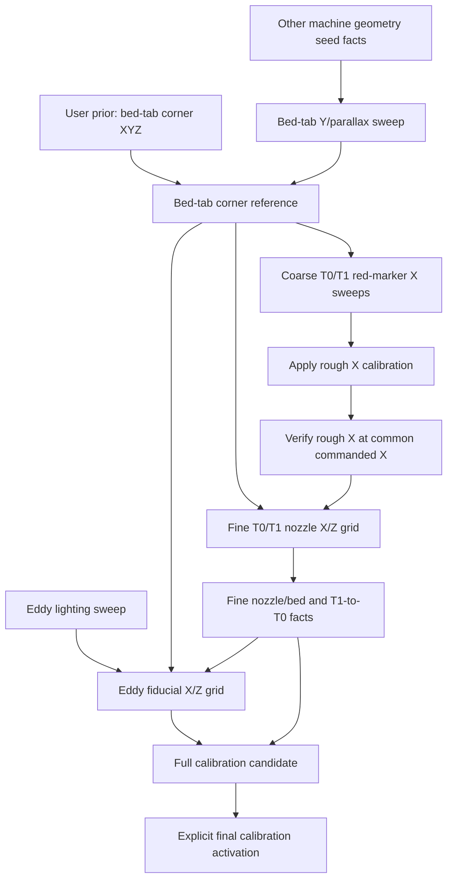

# Vision Calibration Jobs, Facts, and Dependency Graph

## Purpose

This document describes the calibration layer that should sit on top of the
existing Klipper vision-job runtime.

Every vision calibration job has the same three logical phases:

1. generate and run deterministic G-code that acquires a declared set of images
2. analyze only those committed images
3. publish the facts supported by the analysis

The important addition is that facts are versioned inputs to later jobs.
Downstream results bind to exact upstream fact IDs, not merely to names such as
“the current bed calibration.” When an authoritative job publishes replacement
facts, results derived from the replaced facts become stale.

This makes calibration a reproducible dependency graph instead of a sequence of
scripts that happen to share values in `calib.yaml`.

The clean acquisition runtime, synchronized capture, and job directory layout
are described in `VISION_JOB_CONCEPT.md`. This document defines the
calibration-specific graph above that runtime.

### Terminology note

The first bed-tab job below uses a commanded printer **Y** sweep. That is the
axis that establishes the image-space Y/parallax mapping and is consistent with
the later statement that the image X-axis direction is not known yet. If the
machine eventually exposes this physical motion under another axis name, the
job definition can change its commanded axis without changing the fact types.

## Design Principles

- Raw images, manifests, sidecars, analysis results, and facts are immutable.
- Re-analysis creates a new analysis run; it never rewrites old facts.
- Relative image registration is preferred. A detector may locate a tight ROI,
  but calibration should come from aligning homologous image content.
- A missing red marker or hidden nozzle rejects that observation, not
  necessarily the whole acquisition.
- Facts carry units, coordinate frames, concrete quality measurements, and
  provenance.
- Do not invent or propagate uncertainty estimates or covariance matrices.
  Store directly observed evidence such as residuals, repeatability,
  correlation, accepted/rejected observations, and sweep coverage.
- Job definitions declare the fact types they require and produce.
- A concrete job manifest binds every requirement to an exact fact ID.
- Only accepted authoritative facts advance the current calibration graph.
- Rejected and diagnostic jobs remain visible but do not invalidate anything.
- Applying calibration is a separate state-changing operation with its own
  provenance. An image analyzer never silently edits live configuration.
- Stale facts remain inspectable. Staleness prevents reuse; it does not erase
  history or automatically roll back an active printer configuration.

## Runtime Model

The word “job” is useful in the UI, but the persisted model should distinguish
acquisition from analysis:

```text
Vision calibration run
  |
  +-- Acquisition run
  |     manifest.json
  |     acquisition.gcode
  |     frames/*.jpg
  |     frames/*.json
  |
  +-- Analysis run 1
  |     result.json
  |     facts.json
  |     overlays/
  |
  +-- Analysis run 2
        result.json
        facts.json
        overlays/
```

An acquisition run is tied to printer motion and camera state. It cannot be
repeated without creating a new acquisition ID.

An analysis run is pure: it consumes one acquisition plus exact upstream facts.
Improved analysis code may analyze the same images again, but it produces a new
analysis ID and new fact set.

The existing job states continue to describe acquisition and the first
analysis:

```text
prepared -> acquiring -> acquired -> analysing -> completed
```

The calibration catalog adds graph-level status:

- `current`: accepted and selected as the current fact set for its scope
- `stale`: accepted, but at least one exact input fact is no longer current
- `superseded`: replaced by a newer accepted fact set with the same semantic
  output and applicability scope
- `rejected`: analysis completed but did not publish usable facts
- `diagnostic`: deliberately non-authoritative and never selected as current

## Calibration Dependency Graph

The intended end-to-end graph is:



The graph contains two kinds of roots:

- observed roots, produced by vision jobs
- versioned seed facts, including the user-defined bed-tab corner printer XYZ,
  the tab-plane-to-print-plane Z relationship, camera identity, and the active
  Klipper configuration fingerprint

Seed facts use the same provenance and invalidation rules as image-derived
facts. Changing the user-defined bed-tab corner coordinates or a CAD geometry
fact therefore invalidates every downstream fact that used the old fact ID.

## Calibration Stages

### 0. User-defined bed-tab coordinate prior

Before any absolute calibration job can run, the user defines the printer
coordinates of the physical bed-tab corner:

```yaml
bed_tab_corner_prior:
  x_mm: 170.0  # illustrative only; user must measure and replace
  y_mm: -20.0  # illustrative only; user must measure and replace
  z_mm: 0.0    # defined to be the bed/print reference plane
```

The approximate X and Y values above are planning examples, not production
defaults. The first real calibration branch is blocked until the user supplies
numeric X and Y values and records how they were measured. Z is defined as
`0 mm` for this reference.

This is an authoritative initial prior fact:

- `bed.tab_corner.printer_xyz`
- provenance source `user_initial_prior`
- user-supplied X/Y measurement method
- exact `Z=0` definition
- revision, timestamp, and canonical fact hash

Vision does not discover or silently refine these absolute printer
coordinates. The corner-reference job finds the corresponding pixel and binds
that observation to this prior. Replacing the prior later creates a new fact ID
and makes the corner reference, rough X calibration, fine nozzle calibration,
Eddy geometry, and full calibration candidate stale.

### 1. Bed-tab Y/parallax scale

Job type:

```text
nozzle_cam_bed_tab_y_scale
```

Acquisition:

- use fixed exposure and bed-tab lighting
- move commanded Y back and forth by known distances
- capture the bed-tab edge or another textured patch rigidly attached to the
  same reference
- include reversals so backlash or direction-dependent registration can be
  measured
- no absolute feature detection is required

Analysis:

- select one good reference patch
- align every other image to the reference with tight relative template
  registration
- fit pixel displacement against commanded Y
- reject low-correlation matches, direction-dependent outliers, and patches
  whose parallax differs from the bed-tab plane

Produced fact:

- `camera.nozzle_cam.bed_tab.y_parallax_model`, containing the measured
  two-dimensional image displacement per commanded Y millimetre plus concrete
  quality measurements and artifact hashes

Scalar scale, inverse scale, and angle are derived in reports. They are not
published as redundant graph facts.

These facts establish an image-space Y direction and local scale. They do not
yet establish the image X direction or an absolute image origin.

### 2. Bed-tab corner reference

Job type:

```text
nozzle_cam_bed_tab_corner
```

Dependencies:

- current accepted bed-tab Y/parallax facts
- current user-defined `bed.tab_corner.printer_xyz` prior
- versioned tab-plane-to-print-plane Z relationship

Acquisition:

- capture several duplicates of the bed-tab corner at a fixed safe pose
- use fixed lighting and exposure from the bed-tab target profile

Analysis:

- find the two tab edges and their intersection
- use edge or line detection only for initial localization
- refine the corner by registering duplicates to a selected reference image
- project the corner through the accepted Y mapping

Produced facts:

- `bed.tab_corner.pixel_xy`
- `bed.tab_corner.repeatability_px`
- `bed.reference_plane.z_relative_to_print_plane_mm`
- `camera.nozzle_cam.partial_bed_coordinate_system`
- `bed.tab_corner.image_reference`, which binds the observed pixel to the exact
  user-prior fact ID

At this point one pixel has an absolute bed X/Y identity, and the image Y basis
is known because the pixel observation is bound to the user’s prior. The
physical X coordinate of the tab corner is known, but the image X-axis
direction and X scale are still unresolved.

### 3. Coarse red-marker X sweeps

Job type:

```text
idex_tool_red_marker_x_sweep
```

Dependencies:

- current bed-tab corner facts
- current bed-tab Y/parallax facts
- current active calibration snapshot

Acquisition:

- run T0 and T1 independently
- command X positions `160, 170, 180, 190, 200, 210 mm`
- use fixed `Y` and commanded `Z=2 mm`
- raise to a safe travel Z before tool changes
- capture one image per commanded position and tool

The red marker is expected to be absent from some images. Absence is an
ordinary rejected observation.

Analysis:

- locate red pixels only to create a tool-local search ROI
- retain detections with acceptable color, shape, and non-clipped bounds
- fit the red-marker image trajectory against commanded X for each tool
- compare T0 and T1 trajectory direction and scale
- project the trajectories relative to the bed-tab corner

Produced facts:

- `camera.nozzle_cam.image_x_axis_vector_px_per_mm_at_z2`
- `camera.nozzle_cam.image_x_axis_angle`
- `tool.t0.red_marker_to_bed_tab_x_mm`
- `tool.t1.red_marker_to_bed_tab_x_mm`
- `tool.t1.rough_x_error_relative_to_t0_mm`
- marker visibility intervals and fit quality

The red marker is suitable for coarse localization because it is easy to find
over a large range. It is not the final nozzle reference.

### 4. Rough X calibration activation and verification

Operation type:

```text
apply_rough_t1_x_calibration
```

Dependencies:

- accepted coarse red-marker facts
- exact `bed.tab_corner.printer_xyz` prior transitively used by those facts
- exact active configuration fingerprint used by the coarse acquisition

Behavior:

- keep T0 as the physical reference
- interpret the red-marker trajectories in the absolute coordinate system
  anchored by the exact user-supplied bed-tab corner prior
- create a candidate changing only `tools.t1.x_endstop`
- record old value, correction, new value, source fact IDs, source config hash,
  and generated config fingerprint
- apply only after explicit approval
- restart Klipper and require a ready state

Produced activation fact:

- `calibration.rough_t1_x.active_snapshot`

Verification job:

```text
verify_rough_t1_x_red_marker
```

It commands T0 to `X=200`, then T1 to `X=200`, and captures both markers. The
markers should appear approximately at the same image position. This is a
coarse gate, not the final X calibration.

The fine X/Z job requires both the active rough-X snapshot and its accepted
verification fact. This prevents a fine sweep from being generated against
coordinates that were measured but never activated.

### 5. Fine T0/T1 nozzle X/Z grid

Job type:

```text
idex_nozzle_fine_xz_grid
```

Dependencies:

- bed-tab Y/parallax facts
- bed-tab corner and bed reference-plane facts
- active and verified rough-X calibration snapshot
- fixed nozzle lighting/camera profile

Acquisition:

- start approximately `5 mm` to the image-right side of the bed-tab corner
- capture a configurable rectangular grid
- use `3 mm` commanded X increments
- use `2 mm` commanded Z increments
- acquire the same nominal grid for T0 and T1
- keep every commanded Z at or above the job’s declared safety minimum
- capture center duplicates for repeatability

The exact grid extent is a job parameter. It should be kept small enough that
the nozzle remains visible in a tight ROI and large enough to constrain X scale
and its Z dependence.

Analysis is registration-first:

1. locate the nozzle only once per connected visible region
2. construct a tight nozzle ROI
3. align neighboring X images of the same tool
4. align neighboring Z images of the same tool
5. align T0 and T1 images at corresponding corrected poses
6. build a graph of pairwise relative transforms
7. reject weak edges and solve the remaining graph jointly

Circle, orifice, or ellipse detection may seed the ROI, but the fit uses
relative transforms between images. Each pairwise edge records translation,
scale, correlation, registration residual, and rejection reason.

The model should solve at least:

- T0-to-T1 nozzle X offset
- T0-to-T1 nozzle Z offset
- T0-to-T1 nozzle Y offset using the bed-tab Y coordinate system
- X scale at the bed reference plane
- variation of X scale with Z
- T0 nozzle Z relative to the vision-observed bed reference plane
- T0 nozzle X relative to the bed-tab corner

Produced facts:

- `camera.nozzle_cam.nozzle.x_scale_px_per_mm_at_bed_plane`
- `camera.nozzle_cam.nozzle.x_scale_slope_per_z`
- `tool.t0.nozzle_to_bed_tab_xyz_mm`
- `tool.t1.nozzle_to_t0_xyz_mm`
- `tool.t0.nozzle_z_to_bed_plane_mm`
- `tool.t1.fine_endstop_correction_xyz_mm`
- model residuals, accepted registration edges, sweep coverage, and outliers

This stage produces a fine calibration candidate. Activation remains a separate
operation and records the exact fact set used.

### 6. Eddy lighting

Job type:

```text
eddy_fiducial_lighting_sweep
```

This job is independent of nozzle calibration except for the safe pose needed
to see the Eddy assembly. It produces:

- fixed camera exposure
- exact per-pixel light values
- fiducial ROI
- duplicate correlation and center-repeatability quality

The accepted lighting fact can be produced early and reused by the final Eddy
geometry job. Re-running and accepting a new Eddy lighting job invalidates Eddy
geometry facts but does not invalidate nozzle calibration facts.

### 7. Eddy fiducial X/Z grid

Job type:

```text
eddy_fiducial_xz_grid
```

Dependencies:

- current accepted fine T0/nozzle calibration facts
- bed-tab coordinate and bed reference-plane facts
- current accepted Eddy lighting facts
- active configuration fingerprint

Acquisition:

- select T0
- use the accepted fixed Eddy lighting
- work in the known viewing region around commanded `X=230 mm`
- sweep X and Z around the visible fiducial
- capture duplicates at the central pose

Analysis:

- use the concentric-ring/cross detector only to establish the first tight ROI
- register neighboring fiducial images relatively across X and Z
- fit the same camera scale/parallax model used by the nozzle grid
- compare the fitted fiducial position directly with the accepted T0 nozzle
  reference

Produced facts:

- `eddy.fiducial_to_t0_nozzle_xyz_mm`
- `eddy.fiducial_plane_to_bed_plane_mm`
- `eddy.fiducial.repeatability`
- optional `eddy.coil_plane_to_fiducial_plane_mm` from a separate CAD/metrology
  seed fact

There is deliberately no `eddy.fiducial_to_bed_tab_xyz_mm` fact. That vector
would only compose `eddy.fiducial_to_t0_nozzle_xyz_mm` with the accepted T0
nozzle-to-bed reference, so storing it would duplicate information and create
an unnecessary invalidation target. Reports may calculate that composed vector
on demand while retaining the exact source fact IDs.

The visible fiducial and the electrical sensing plane must not be assumed to be
identical unless an explicit zero correction fact says so.

### 8. Full calibration candidate

Operation type:

```text
assemble_full_vision_calibration
```

Dependencies:

- accepted fine nozzle fact set
- accepted Eddy geometry fact set
- all exact seed facts used by those results
- current base configuration fingerprint

Output:

- complete `calib.yaml` candidate
- exact old/new values
- full input fact binding
- generated printer configuration fingerprint
- residual and quality summary

The resulting calibration knows:

- bed reference-plane Z in the images
- image X and Y directions and local scale
- T0 nozzle position relative to the bed reference
- T1 nozzle X/Y/Z offsets relative to T0
- Eddy fiducial X/Y/Z offset relative to T0
- optional Eddy coil-plane correction relative to the visible fiducial

Final activation is explicit and produces a new active calibration snapshot.

## Data Structures

### User-prior fact

The bed-tab XYZ prior should be stored as a normal immutable fact set rather
than as an undocumented constant in an analyzer:

```yaml
schema_version: 1
fact_set_id: sha256:...
status: accepted
authoritative: true
producer:
  source: user_initial_prior
  recorded_at_utc: ...
applicability:
  printer: menderpi
facts:
  - fact_id: sha256:...
    fact_type: bed.tab_corner.printer_xyz
    value:
      x: 170.0
      y: -20.0
      z: 0.0
    unit: mm
    coordinate_frame: printer_xyz
    definition:
      z: bed_print_reference_plane
    provenance:
      entered_by: user
      measurement_method: to_be_recorded
      provisional: true
```

The example X/Y values are placeholders. The user replaces them before the
first authoritative run. Editing this file does not mutate an existing fact:
it publishes a new prior fact set and triggers normal downstream invalidation.

### Job-type definition

Job types should be registered declaratively, for example in
`vision_job_types.yaml`:

```yaml
schema_version: 1
job_type: idex_nozzle_fine_xz_grid
definition_version: 1
acquisition_generator: vision_calibration:build_fine_xz_job
analyzer: vision_calibration:analyze_fine_xz_job
requires:
  - fact_type: camera.nozzle_cam.bed_tab.y_parallax_model
    current: true
  - fact_type: bed.tab_corner.printer_xyz
    current: true
  - fact_type: calibration.rough_t1_x.active_snapshot
    current: true
  - fact_type: calibration.rough_t1_x.verified
    current: true
produces:
  - camera.nozzle_cam.nozzle.x_scale_px_per_mm_at_bed_plane
  - tool.t0.nozzle_to_bed_tab_xyz_mm
  - tool.t1.nozzle_to_t0_xyz_mm
safety:
  required_homed_axes: xyz
  require_idle: true
  require_heaters_off: true
  minimum_commanded_z_mm: 1.0
```

The registry declares interfaces and safety. The generated manifest records the
resolved parameters and exact inputs for one run.

### Acquisition manifest

Extend the existing immutable `manifest.json` with fact bindings:

```json
{
  "schema_version": 2,
  "job_id": "idex_nozzle_fine_xz_grid_20260729T180000Z",
  "job_type": "idex_nozzle_fine_xz_grid",
  "job_definition_version": 1,
  "manifest_hash": "sha256:...",
  "gcode_hash": "sha256:...",
  "active_config_fingerprint": "sha256:...",
  "input_facts": [
    {
      "requirement": "bed_y_model",
      "fact_type": "camera.nozzle_cam.bed_tab.y_parallax_model",
      "fact_id": "sha256:...",
      "fact_set_id": "sha256:..."
    },
    {
      "requirement": "rough_x_snapshot",
      "fact_type": "calibration.rough_t1_x.active_snapshot",
      "fact_id": "sha256:...",
      "fact_set_id": "sha256:..."
    }
  ],
  "parameters": {
    "x_step_mm": 3.0,
    "z_step_mm": 2.0,
    "minimum_commanded_z_mm": 1.0
  },
  "frames": []
}
```

Preparing a job fails if a required current fact cannot be resolved. Once
prepared, the bindings never change. Starting the job rechecks that the bound
facts and active configuration are still current.

### Analysis run

`analysis/<analysis_run_id>/analysis.json` records how images became results:

```json
{
  "schema_version": 1,
  "analysis_run_id": "sha256:...",
  "acquisition_job_id": "idex_nozzle_fine_xz_grid_20260729T180000Z",
  "analyzer": "vision_calibration:analyze_fine_xz_job",
  "analyzer_version": "git:...",
  "input_manifest_hash": "sha256:...",
  "input_fact_ids": ["sha256:...", "sha256:..."],
  "started_at_utc": "...",
  "completed_at_utc": "...",
  "result_path": "result.json",
  "result_sha256": "sha256:..."
}
```

`result.json` remains diagnostic and may be large. It contains every
registration, residual, rejected observation, overlay link, model parameter,
and directly measured quality value.

### Fact set

Facts from one accepted analysis are published atomically as a fact set:

```json
{
  "schema_version": 1,
  "fact_set_id": "sha256:...",
  "status": "accepted",
  "authoritative": true,
  "producer": {
    "job_id": "idex_nozzle_fine_xz_grid_20260729T180000Z",
    "analysis_run_id": "sha256:...",
    "manifest_hash": "sha256:..."
  },
  "inputs": [
    {"fact_id": "sha256:...", "role": "bed_y_model"},
    {"fact_id": "sha256:...", "role": "rough_x_snapshot"}
  ],
  "applicability": {
    "printer": "menderpi",
    "camera": "nozzle_cam",
    "camera_serial": "...",
    "image_size_px": [1920, 1080],
    "profile": "analysis",
    "active_config_fingerprint": "sha256:..."
  },
  "facts": [
    {
      "fact_id": "sha256:...",
      "fact_type": "tool.t1.nozzle_to_t0_xyz_mm",
      "value": {"x": -0.12, "y": 0.04, "z": -0.08},
      "unit": "mm",
      "coordinate_frame": "printer_xyz",
      "quality": {
        "accepted_edges": 42,
        "fit_rms_px": 0.31
      }
    }
  ]
}
```

Fact IDs are hashes of canonical fact content plus provenance. Numerical facts
must always declare units and coordinate frame. Image coordinates must state
their origin and axis convention.

### Fact catalog

Immutable job directories are the source of truth. A generated catalog is a
rebuildable index:

```json
{
  "schema_version": 1,
  "heads": {
    "camera.nozzle_cam.bed_tab.y_parallax_model": "sha256:...",
    "bed.tab_corner.printer_xyz": "sha256:...",
    "tool.t1.nozzle_to_t0_xyz_mm": "sha256:..."
  },
  "fact_sets": {
    "sha256:...": {
      "status": "current",
      "job_id": "...",
      "depends_on": ["sha256:..."],
      "supersedes": "sha256:..."
    }
  },
  "reverse_dependencies": {
    "sha256:upstream": ["sha256:downstream"]
  }
}
```

The first implementation can rebuild this file by scanning job directories.
It does not require a database.

### Calibration snapshot

Applying rough or final calibration creates an immutable snapshot:

```yaml
schema_version: 1
snapshot_id: sha256:...
kind: rough_t1_x
status: active
base_config_fingerprint: sha256:...
source_fact_ids:
  - sha256:...
changes:
  tools.t1.x_endstop:
    old: 357.532
    new: 347.380
generated_config_fingerprint: sha256:...
applied_at_utc: ...
```

The active printer configuration and the vision fact graph can therefore be
compared exactly.

## Dependency Resolution and Invalidation

### Publishing new facts

When an authoritative analysis finishes:

1. validate its manifest, images, sidecars, input fact hashes, and analyzer
   output
2. write the immutable fact set
3. select each produced semantic fact as the new head for its applicability
   scope
4. mark the previous head as `superseded`
5. traverse reverse dependencies from the superseded fact IDs
6. mark every dependent fact set and unapplied candidate as `stale`
7. mark active calibration snapshots as `provenance_stale` when appropriate
8. refresh `/vision/`

A rejected analysis publishes diagnostics but no current facts, so it
invalidates nothing.

An explicitly diagnostic run writes `authoritative: false`. It can compare
algorithms without changing graph heads or invalidating downstream work.

### Stale active calibration

If an upstream fact is replaced after a calibration was applied:

- the loaded printer configuration remains active
- the snapshot is visibly marked `provenance_stale`
- no automatic rollback occurs
- downstream calibration jobs requiring current facts are blocked
- the UI explains exactly which input fact was superseded

This separates machine safety from provenance correctness.

### Re-analysis

Re-analyzing old images:

- creates a new analysis run
- binds the same acquisition manifest and original upstream fact IDs
- may publish a new fact set
- can become current only if its applicability still matches the printer and
  the user permits authoritative publication

The analyzer must never silently reinterpret old images using newer calibration
facts that were not bound in the original manifest.

### Cycles

Job-type dependencies must form a directed acyclic graph. Calibration activation
breaks the apparent measurement/application loop:

```text
coarse images -> rough correction fact -> active snapshot -> fine images
```

The fine job depends on the new active snapshot, not on itself.

## UI at `/vision/`

The current job pages remain useful. Add a calibration graph view showing:

- each job type and whether it is ready, blocked, running, current, stale, or
  rejected
- the exact current fact set for each stage
- dependencies and the reason a stage is blocked
- which downstream facts became stale after a rerun
- active calibration snapshots and provenance state
- a recommended “next runnable job”

Each job page should show:

- acquisition manifest and frame progress
- bound input facts with links to their producing jobs
- analysis runs for the acquisition
- produced facts and their current/stale status
- downstream consumers
- overlays and rejected observations
- candidate calibration changes, if any

The UI may provide explicit actions:

- prepare/run a ready acquisition job
- re-analyze an acquisition diagnostically
- publish an accepted diagnostic analysis as authoritative
- generate a calibration candidate
- activate a candidate after confirmation

No page should silently apply calibration because analysis completed.

## Implementation Plan

### 1. Add the fact and graph core

- define schemas for job-type definitions, analysis runs, fact sets, the fact
  catalog, and calibration snapshots
- implement canonical hashing and schema validation
- implement catalog rebuilding by scanning existing job directories
- implement exact dependency binding and cycle detection
- implement staleness propagation

### 2. Establish the clean job runtime

- start manifests, analyses, fact sets, publications, and the catalog at schema
  version 1
- retain only generated G-code, synchronous framebuffer capture, camera
  profiles, and Moonraker execution as low-level infrastructure
- write immutable analysis runs into versioned analysis subdirectories
- reject previous manifests, flat fact files, aliases, and historical job
  layouts

### 3. Implement the bed reference foundation

- add the user-editable, versioned bed-tab corner XYZ prior; require explicit
  X/Y values and define Z as `0 mm`
- implement the bed-tab Y/parallax sweep
- implement bed-tab corner acquisition and duplicate registration
- bind the observed corner pixel to the exact user-prior fact ID
- add the remaining tab-plane-to-print-plane geometry seed facts
- expose both stages and their dependency state in `/vision/`

### 4. Implement and activate rough X

- implement the sparse T0/T1 red-marker sweep
- tolerate missing-marker images
- produce and explicitly apply a T1-X-only candidate
- add the two-frame common-X verification job

### 5. Implement the fine nozzle model

- generate the local X/Z grid from the accepted bed corner and rough-X
  snapshot
- build pairwise tight-ROI registrations
- solve the registration graph and camera model jointly
- publish nozzle/bed and T1-to-T0 facts with their measured fit-quality data

### 6. Implement Eddy geometry

- expose the existing Eddy lighting sweep as a fact-producing job
- implement the T0 Eddy X/Z grid around `X=230`
- publish the fiducial-plane-to-bed height and fiducial-to-nozzle XYZ facts
- combine with an explicit fiducial-to-coil-plane seed fact

### 7. Assemble and activate full calibration

- generate complete candidates from exact current fact IDs
- verify source and generated config fingerprints
- deploy only through an explicit activation operation
- retain rollback snapshots and show provenance state in `/vision/`

## Tests

Core graph tests:

- canonical hashes are stable
- missing requirements block job preparation
- manifests bind exact current fact IDs
- dependency cycles are rejected
- an accepted authoritative replacement marks downstream fact sets stale
- rejected and diagnostic jobs invalidate nothing
- stale active snapshots remain active but cannot satisfy current-fact
  requirements
- rebuilding the catalog from immutable job directories is deterministic

Job tests:

- generated frame order and G-code match each declared sweep
- no frame is commanded below the job safety minimum
- tool changes occur only at safe travel Z
- missing red-marker frames are excluded without inventing detections
- tight neighboring-image registration recovers synthetic X/Z transforms
- outlier registration edges are rejected before model fitting
- coarse and fine correction signs are recovered correctly
- fine-model acceptance fails when the usable observations no longer span the
  declared minimum X and Z ranges
- Eddy lighting and geometry facts invalidate only their true consumers

Provenance tests:

- changing camera identity, image size, profile, CAD geometry hash, or active
  config fingerprint prevents accidental fact reuse
- re-analysis preserves original manifest and input bindings
- candidate YAML records exact old/new values and source fact IDs
- activation records the generated live configuration fingerprint

UI tests:

- `/vision/` shows ready and blocked job types
- stale reasons link to the superseding upstream job
- job pages link inputs, outputs, consumers, images, overlays, and analysis runs
- no rejected or stale fact is presented as current calibration

## Closed Decisions

- Calibration is a fact DAG, not a collection of mutable global values.
- Acquisition and analysis are separately identifiable and immutable.
- Facts are published atomically as sets with exact provenance.
- Relative template registration is the primary measurement method.
- Red and geometric detectors are ROI locators, not final calibration
  measurements.
- Accepted authoritative replacement facts invalidate downstream provenance.
- Rejected jobs do not invalidate anything.
- Applying calibration is explicit and produces an immutable active snapshot.
- The bed-tab corner printer XYZ is a user-defined initial prior; vision binds a
  pixel to it but does not invent its absolute coordinates.
- Changing the bed-tab prior invalidates rough X and every downstream fact.
- The bed-tab reference is established before any tool calibration.
- Rough X is applied and verified before the fine T0/T1 X/Z grid.
- Eddy geometry depends on the accepted T0/nozzle model and independent Eddy
  lighting facts.
