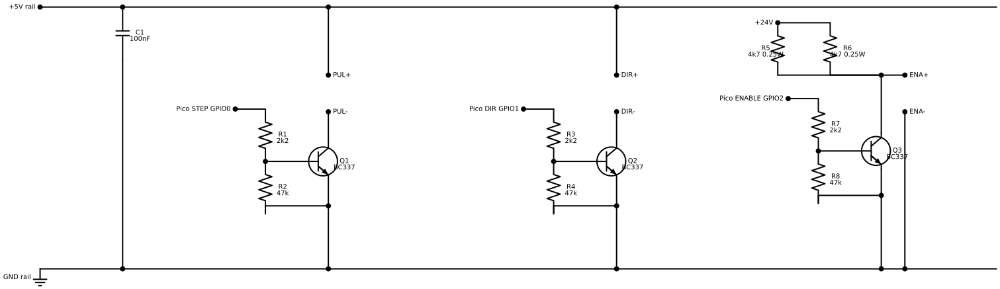

# Pi Pico to TB6600-style stepper driver interface

This is the proposed small stripboard interface for the fake/clone TB6600-style driver shown in the photo. The goal is:

- safe 3.3 V GPIO signalling from the Raspberry Pi Pico
- reliable optocoupler LED drive
- fast enough STEP edges for a belt Y axis
- motor driver disabled/free when the Pico/control system is unpowered or still booting
- minimum practical component count

The design uses three NPN transistors, preferably **BC337**.

Do not use BC517 Darlington transistors here. They are unnecessary and slower, with a higher saturation voltage.



The schematic script also generates
`diagrams/pico_tb6600_stripboard_interface.png` for quick IDE or image-viewer
inspection.

The source for this schematic and the verified stripboard assembly lives in
this wiring directory. `mege-circuits` provides the reusable renderer/planner
library and keeps a TB6600 regression/demo copy, but the IDEX wiring source of
truth is this repository.

The active printer wiring now uses this external TB6600-style driver interface
for Y through the Pico GPIO0/1/2 connector.

## Bench validation

Bench test completed on 2026-07-01 19:49:08 CEST with an Adafruit FT232H, this
stripboard interface, the TB6600-style driver box, and a loose desk stepper.
STEP, DIR, and ENA all worked through the soldered board. At the 8 microstep
bench setting, the motor ran quietly and reliably at the original 500 mm/s
Y-axis equivalent STEP rate. The live printer now uses a 20T GT2 pulley with
`rotation_distance: 40` and 16 microsteps, so the same 500 mm/s target is about
40 kHz STEP. Verified ENA polarity: GPIO low disables the driver and frees the
motor; GPIO high enables the driver and restores holding torque.

Detailed commands, setup notes, and debug findings are recorded in
`bench_tests/TEST_LOG.md`.

## Assumptions

The circuit below assumes the usual TB6600-clone convention:

```text
ENA optocoupler current ON  = driver disabled / off-line / motor free
ENA optocoupler current OFF = driver enabled / motor holding
```

Verify this once before final wiring:

```text
1. Power the driver from 24 V.
2. Connect ENA- to common GND / 24 V-.
3. Connect +24 V -> 2 x 4k7 resistors in parallel -> ENA+.
4. The motor should go free / off-line.
```

If the motor instead only works when ENA current flows, use the alternate enable circuit near the end of this file.

## Supplies and grounds

Use three rails on the stripboard:

```text
+5 V logic    for STEP and DIR optocoupler drive
+24 V motor   for motor power and fail-disabled ENA drive
GND           common ground
```

The schematic draws one +5 V logic rail and one common GND rail. Branches from
those rails are the stripboard taps for PUL+, DIR+, the decoupling capacitor,
the transistor emitters, the pulldowns, and ENA-.

All grounds are tied together:

```text
Pico GND
5 V supply GND
24 V motor supply -
driver GND / motor supply -
stripboard GND
```

This deliberately gives up the driver's opto-isolation. In exchange, the Pico pins are protected and the signal levels are deterministic.

Important: on the driver, the lower **VCC/GND** terminals are the motor supply, not 5 V logic.

## Pico Y-axis interface connector

The planned non-live connector on `pico_w_btt_tmc2226_y_z.yaml` is:

| Connector pin | Pico signal | Purpose |
|---|---|---|
| GND | `PICO_GND_03` | Common logic and driver reference ground |
| DIR | `GPIO1` | Direction signal into the stripboard DIR transistor stage |
| STEP | `GPIO0` | Step pulse into the stripboard STEP transistor stage |
| ENABLE | `GPIO2` | Enable control into the stripboard ENA transistor stage |

These pins are not tagged as active Klipper wiring yet. TMC1 remains the active
Y fallback; when switching live, TMC1 becomes reserved and the commented TB6600
draft block in `printer.cfg.template` must be activated deliberately.

## STEP circuit

Common-anode input drive using an NPN low-side switch:

```text
+5 V logic ---------------------- PUL+
PUL- ---------------------------- C   Q_STEP, BC337
                                     E ---- GND

Pico STEP GPIO ---- 2k2 ---- B
                         |
                        47k
                         |
                        GND
```

Behaviour:

```text
Pico STEP low   -> transistor off -> PUL opto off
Pico STEP high  -> transistor on  -> PUL opto on
```

So the STEP pin is not inverted in Klipper.

This build wires PUL+ directly to +5 V logic. The TB6600-style inputs are
treated as 5 V optocoupler inputs with their own internal current limiting.

## DIR circuit

Same circuit as STEP:

```text
+5 V logic ---------------------- DIR+
DIR- ---------------------------- C   Q_DIR, BC337
                                     E ---- GND

Pico DIR GPIO ---- 2k2 ---- B
                        |
                       47k
                        |
                       GND
```

Direction may need inversion in Klipper depending on motor wiring and axis orientation.

## ENA circuit, fail-disabled using 24 V

This is the recommended enable circuit if ENA current disables the driver:

```text
+24 V motor supply ---- 4k7 / 0.25 W ----+
                                         |
+24 V motor supply ---- 4k7 / 0.25 W ----+---- ENA+
                                         |
                                         C   Q_ENA, BC337
Pico ENABLE GPIO ---- 2k2 ---- B         |
                         |               E ---- ENA- ---- common GND / 24 V-
                        47k
                         |
                        GND
```

Behaviour:

```text
Pico unpowered / reset / GPIO low:
    Q_ENA is off
    +24 V feeds ENA through the two parallel 4k7 resistors
    ENA opto current flows
    driver is disabled / motor free

Pico ENABLE GPIO high:
    Q_ENA turns on
    ENA+ is shunted to ENA-
    ENA opto current is almost zero
    driver is enabled / motor holding
```

The two 4k7 resistors share the heat. Their effective resistance is roughly
2k35. When Q_ENA is on, the pair dissipates roughly:

```text
P_total = 24^2 / 2350 = 0.25 W
P_each  = 0.12 W
```

This is sized for the printer's 24 V motor supply. Do not use this resistor
network as-is for a 42 V supply.

`ENA-` means the TB6600 driver's ENA-minus optocoupler terminal. In this
stripboard interface it is tied to the same common ground as Pico GND and the
24 V supply negative terminal.

## Klipper configuration

Example for a 20-tooth GT2 pulley:

```ini
[stepper_y]
step_pin: gpio0
# Add ! if the axis moves the wrong way:
dir_pin: !gpio1
enable_pin: gpio2

microsteps: 8
rotation_distance: 40
full_steps_per_rotation: 200

# Conservative pulse width for clone drivers with optocoupler inputs:
step_pulse_duration: 0.000005
```

For the target Y axis speed:

```text
20T GT2 pulley:       40 mm/rev
1.8 deg motor:        200 full steps/rev
8 microsteps:         1600 steps/rev
500 mm/s step rate:   20 kHz
```

This is a good starting point for this class of driver. Avoid 32 microsteps for this use case. Use 8 microsteps first; try 16 only after the axis is proven stable.

If the driver DIP table on the case is correct, 8 microsteps is:

```text
S1 = OFF
S2 = ON
S3 = OFF
```

Set the current DIP switches to match the motor's rated phase current. Do not trust the clone driver current labels too much; start conservatively and check motor and driver temperature.

## Rough BOM

| Qty | Part | Value / type | Notes |
|---:|---|---|---|
| 3 | NPN transistor | BC337, TO-92 | One each for STEP, DIR, ENA. BC547B is acceptable for STEP/DIR, but BC337 is preferred. |
| 3 | Base resistor | 2k2 | Pico GPIO to transistor base. 4k7 also works, but 2k2 gives more certain saturation. |
| 3 | Base pulldown | 47k | Base to GND, keeps all channels off during reset or unpowered Pico state. |
| 2 | ENA feed resistor | 4k7, 0.25 W | Parallel pair from +24 V to ENA+. Do not replace with a single 0.25 W 2k2 resistor. |
| 1 | Decoupling capacitor | 100 nF ceramic | Across +5 V and GND on the stripboard. Recommended. |
| 1 | Stripboard | small piece | Keep STEP wiring short and label the terminals. |
| as needed | Connectors / headers | screw terminals or pin headers | For Pico signals, +5 V, +24 V, GND, and driver inputs. |

## Stripboard connection checklist

```text
Build one +5 V rail:
+5 V rail -> PUL+
+5 V rail -> DIR+
+5 V rail -> C1

Build one common GND rail:
common GND rail -> Pico GND
common GND rail -> 5 V supply GND
common GND rail -> 24 V-
common GND rail -> driver GND
common GND rail -> Q_STEP emitter and pulldown
common GND rail -> Q_DIR emitter and pulldown
common GND rail -> Q_ENA emitter and pulldown
common GND rail -> ENA-
common GND rail -> C1

Pico GPIO STEP  -> 2k2 -> Q_STEP base
Q_STEP emitter  -> common GND rail
Q_STEP collector -> PUL-

Pico GPIO DIR   -> 2k2 -> Q_DIR base
Q_DIR emitter   -> common GND rail
Q_DIR collector -> DIR-

Pico GPIO ENABLE -> 2k2 -> Q_ENA base
Q_ENA emitter    -> common GND rail
Q_ENA collector  -> ENA+
+24 V            -> 2 x 4k7 / 0.25 W in parallel -> ENA+
ENA-             -> common GND rail

Each transistor base -> 47k -> common GND rail
100 nF capacitor between +5 V rail and common GND rail near the board
```

## Power-up behaviour

Expected behaviour with the recommended ENA circuit:

```text
24 V on, Pico off:        driver disabled / motor free
24 V on, Pico booting:    driver disabled / motor free
Klipper disables motor:   driver disabled / motor free
Klipper enables motor:    driver enabled / motor holding
```

## Alternate ENA circuit if your clone uses the opposite ENA polarity

Use this only if the bench test shows:

```text
ENA current ON = driver enabled
ENA current OFF = driver disabled
```

Then wire ENA as a normal low-side switched opto input:

```text
+24 V motor supply ---- 2 x 4k7 / 0.25 W in parallel ---- ENA+
ENA- ----------------------------------- C   Q_ENA, BC337
                                           E ---- common GND / 24 V-

Pico ENABLE GPIO ---- 2k2 ---- B
                         |
                        47k
                         |
                        GND
```

Klipper can still use:

```ini
enable_pin: gpio4
```

In this alternate circuit, GPIO high turns Q_ENA on, ENA current flows, and the driver enables.

## Notes

- Check the BC337 pinout from the actual transistor source before soldering. TO-92 pinouts are a small trapdoor in the floor.
- Keep STEP and DIR wires away from motor phase wires.
- Do not connect 24 V directly to any Pico pin.
- The Pico only drives transistor bases through resistors, so the GPIOs see small, safe currents.
- No flyback diodes are needed; the loads are optocoupler LEDs, not coils.
